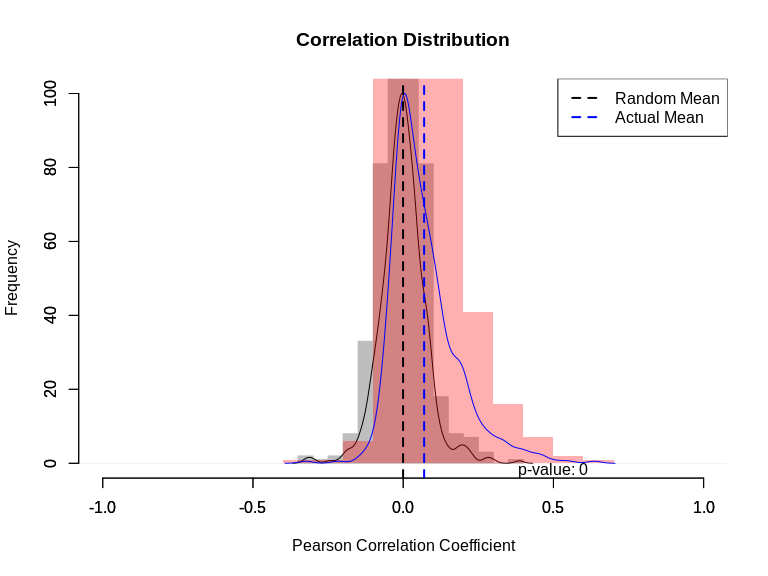

[](https://doi.org/10.5281/zenodo.15861905)


# lncRNACNVIntegrateR

`lncRNACNVIntegrateR` is an R package designed to integrate **copy
number variation (CNV)** and **long non-coding RNA (lncRNA)** expression
data for the identification of novel **prognostic biomarkers**. By
detecting key lncRNAs influenced by CNVs, this package provides valuable
insights into disease mechanisms, enabling personalized treatment
strategies and improving clinical decision-making.

-----

## ✨ Key Features

  - Integrates CNV and lncRNA expression datasets seamlessly.
  - Identifies **prognostic lncRNA biomarkers** associated with
    survival.
  - Builds **risk score models** to stratify patients into high- and
    low-risk groups.
  - Performs **functional enrichment** on correlated protein-coding
    genes (PCGs).
  - Generates publication-quality visualizations for interpretation.

-----

## Workflow Overview

1.  **Input Data Preparation**
      - CNV profiles
      - lncRNA expression matrix
      - Clinical survival data
      - lncRNA genomic positions (from GTF)
2.  **Data Processing & Integration**
      - Filter and map lncRNA expressions.
      - Correlate CNVs with lncRNAs.
3.  **Biomarker Identification**
      - Detect CNV-driven lncRNAs.
      - Identify survival-related lncRNAs.
4.  **Model Development & Interpretation**
      - Build risk score model (Cox regression).
      - Visualize risk groups & perform survival analysis.
      - Perform pathway enrichment of correlated PCGs.

-----

## Main Functions

| Function                                            | Description                                                         |
| --------------------------------------------------- | ------------------------------------------------------------------- |
| `input_cnv()`                                       | Reads CNV data                                                      |
| `input_expr()`                                      | Reads gene expression data                                          |
| `input_clin()`                                      | Reads clinical survival data                                        |
| `input_lncRNA_positions()`                          | Reads lncRNA genomic positions                                      |
| `preprocessing_and_preparation()`                   | Prepares final matrices for correlation analysis                    |
| `Correlation_lncRNA_and_CNVs()`                     | Calculates correlations between CNVs and lncRNAs                    |
| `extract_survival_related_significant_lncRNA()`     | Identifies survival-associated lncRNAs                              |
| `visualization_of_lncRNA_and_CNVs_association()`    | Visualizes significant CNV-lncRNA relationships                     |
| `Risk_score_model_development()`                    | Builds risk score model using multivariate Cox regression           |
| `Correlation_with_PCGs_and_functional_enrichment()` | Identifies correlated PCGs and performs pathway enrichment analysis |

## Installation

You can install the development version of lncRNACNVIntegrateR like so:

``` r
pak::pak("tbgicgeb/lncRNACNVIntegrateR")
```

-----

## Function Usage

To check detailed documentation of each function, use the following
commands in R:

``` r
?input_cnv
?input_expr
?input_clin
?input_lncRNA_positions
?preprocessing_and_preparation
?Correlation_lncRNA_and_CNVs
?extract_survival_related_significant_lncRNA
?visualization_of_lncRNA_and_CNVs_association
?Risk_score_model_development
?Correlation_with_PCGs_and_functional_enrichment
```

## Troubleshooting Dependency: `enrichR`

The `lncRNACNVIntegrateR` package relies on the `enrichR` package, which
behaves differently based on the R version:

1.  **R Versions ≤ 4.1.2**: `enrichR` is available on CRAN and installs
    automatically.
2.  **R Versions ≥ 4.2.0**: `enrichR` is not available on CRAN. If you
    encounter an error related to `enrichR`, follow these steps:

Install `enrichR` from GitHub: `R if (!requireNamespace("devtools",
quietly = TRUE)) { install.packages("devtools") }
devtools::install_github("wjawaid/enrichR")` After installing `enrichR`,
install `lncRNACNVIntegrateR`

### macOS Users

If you encounter errors related to `tcltk` or X11 during installation,
please ensure `XQuartz` is installed: [Download
XQuartz](https://www.xquartz.org/)

## Example

This is a basic example which shows you how to solve a common problem:

``` r
library(lncRNACNVIntegrateR)

expr_file <- system.file("extdata", "gene_expression_COAD.txt.gz", package = "lncRNACNVIntegrateR")
cnv_file <- system.file("extdata", "CNV_data_COAD.txt.gz", package = "lncRNACNVIntegrateR")
lncRNA_file_path <- system.file("extdata", "all_lncRNAs_positions.txt", package = "lncRNACNVIntegrateR")
clin_file <- system.file("extdata", "clinical_data_COAD.txt.gz", package = "lncRNACNVIntegrateR")

## Reading Expression data file ###
input_expr <- function(file_path = NULL) {
  if (is.null(file_path)) {
    # Use the system file if no path is provided
    file_path <- expr_file
  }

  if (!file.exists(file_path)) {
    stop("The file does not exist: ", file_path)
  }

  if (grepl("\\.gz$", file_path)) {
    con <- gzfile(file_path, "rt")
    x <- read.table(con, header = TRUE, sep = "\t", stringsAsFactors = FALSE)
    close(con)
  } else {
    x <- read.table(file_path, header = TRUE, sep = "\t", stringsAsFactors = FALSE)
  }

  return(x)
}
expr_df <- input_expr(expr_file)
head(expr_df[1:5,1:5])
#>                              TSPAN6 TNMD DPM1 SCYL3 C1orf112
#> TCGA-CA-6718-01A-11R-1839-07   3078    1 2104   761      719
#> TCGA-AD-6901-01A-11R-1928-07   3730  213 1899   438      197
#> TCGA-AA-A00J-01A-02R-A002-07   1206    3  640   289      169
#> TCGA-CM-4752-01A-01R-1410-07  10100   19 1793   233      187
#> TCGA-AA-3549-01A-02R-0821-07   7003   41 1169   237      231

## Reading CNV data file ###
input_cnv <- function(file_path = NULL) {
  if (is.null(file_path)) {
    # Use the system file if no path is provided
    file_path <- expr_file
  #  file_path <- system.file("extdata", "CNV_data_COAD.txt.gz", package = "lncRNACNVIntegrateR")
  }

  if (!file.exists(file_path)) {
    stop("The file does not exist: ", file_path)
  }

  if (grepl("\\.gz$", file_path)) {
    con <- gzfile(file_path, "rt")
    y <- read.table(con, header = TRUE, sep = "\t", row.names = 1, stringsAsFactors = FALSE)
    close(con)
  } else {
    y <- read.table(file_path, header = TRUE, sep = "\t", row.names = 1, stringsAsFactors = FALSE)
  }

  y <- as.data.frame(y)
  return(y)
}
cnv_df <- input_cnv(cnv_file)
head(cnv_df[1:5,1:5])
#>                 ACAP3 ACTRT2 AGRN ANKRD65 ATAD3A
#> TCGA-3L-AA1B-01     0      0    0       0      0
#> TCGA-4N-A93T-01    -1     -1   -1      -1     -1
#> TCGA-4T-AA8H-01     0      0    0       0      0
#> TCGA-5M-AAT4-01    -1     -1   -1      -1     -1
#> TCGA-5M-AAT5-01    -1     -1   -1      -1     -1

## Reading Clinical data file ###
input_clin <- function(file_path = NULL) {
  if (is.null(file_path)) {
    # Use the system file if no path is provided
    file_path <- clin_file
  #  file_path <- system.file("extdata", "clinical_data_COAD.txt.gz", package = "lncRNACNVIntegrateR")
  }

  if (!file.exists(file_path)) {
    stop("The file does not exist: ", file_path)
  }

  if (grepl("\\.gz$", file_path)) {
    con <- gzfile(file_path, "rt")
    z <- read.table(con, header = TRUE, sep = "\t", row.names = 1, stringsAsFactors = FALSE)
    close(con)
  } else {
    z <- read.table(file_path, header = TRUE, sep = "\t", row.names = 1, stringsAsFactors = FALSE)
  }

  z <- as.data.frame(z)
  return(z)
}
clin_df <- input_clin(clin_file)
head(clin_df[1:5,1:5])
#>                       bcr_patient_uuid bcr_patient_barcode form_completion_date
#> 1                     bcr_patient_uuid bcr_patient_barcode form_completion_date
#> 2                              CDE_ID:      CDE_ID:2003301              CDE_ID:
#> 3 A94E1279-A975-480A-93E9-7B1FF05CBCBF        TCGA-3L-AA1B            2014-4-22
#> 4 92554413-9EBC-4354-8E1B-9682F3A031D9        TCGA-4N-A93T            2014-10-1
#> 5 A5E14ADD-1552-4606-9FFE-3A03BCF76640        TCGA-4T-AA8H             2014-6-5
#>            histologic_diagnosis                  prospective_collection
#> 1             histological_type tissue_prospective_collection_indicator
#> 2                CDE_ID:3081934                          CDE_ID:3088492
#> 3          Colon Adenocarcinoma                                     YES
#> 4          Colon Adenocarcinoma                                     YES
#> 5 Colon Mucinous Adenocarcinoma                                      NO

### Reading lncRNA positions ###
input_lncRNA_positions <- function(file_path = NULL) {
  if (is.null(file_path)) {
    # Use the system file if no path is provided
    #file_path <- expr_file
   file_path <- system.file("extdata", "all_lncRNAs_positions.txt", package = "lncRNACNVIntegrateR")
  }

  if (!file.exists(file_path)) {
    stop("The file does not exist: ", file_path)
  }

  lncRNA_positions <- read.table(file_path, header = TRUE, sep = "\t", row.names = 1)
  return(lncRNA_positions)
}
# Use the function with the predefined file path
lncRNA_positions <- input_lncRNA_positions()
head(lncRNA_positions)
#>             Chromosome     Start       End
#> A1BG-AS1         chr19  58347718  58355455
#> A2M-AS1          chr12   9065163   9068689
#> A2ML1-AS1        chr12   8776219   8830947
#> A2ML1-AS2        chr12   8819816   8820713
#> AADACL2-AS1       chr3 151751443 151928175
#> AATBC            chr21  43805758  43812567

## First function: data preprocessing and preparation ###
preprocessing_and_preparation <- function(expr_df, cnv_df, clin_df) {
  library(DESeq2)
  library(dplyr)
  library(SummarizedExperiment)
  ### Identify if the dataset contains TCGA IDs ###
  # Extract the IDs (row names) from the expression data
  expr_ids <- rownames(expr_df)
  tcga_expr_check <- all(grepl("^TCGA", expr_ids))
  cnv_ids <- rownames(cnv_df)
  tcga_cnv_check <- all(grepl("^TCGA", cnv_ids))
  ## for clinical data ###
  clinical_data <- clin_df
  colnames(clinical_data) <- clinical_data[1, ]
  clinical_data <- clinical_data[-(1:2), ]
  selected_clin <- as.data.frame(clinical_data[, c("bcr_patient_barcode", "vital_status", "days_to_last_followup")])
  rownames(selected_clin) <- selected_clin[, 1]
  selected_clin <- selected_clin[, -1]
  clin_ids <- rownames(selected_clin)
  tcga_clin_check <- all(grepl("^TCGA", clin_ids))

  ### Preprocessing based on ID check ###
  if (tcga_expr_check && tcga_cnv_check && tcga_clin_check) {
    cat("TCGA IDs detected. Proceeding with TCGA-specific data preprocessing...\n")

    ### Processing Expression Data for TCGA ###
    expression_data <- as.data.frame(expr_df)
    shortened_row_names <- substr(rownames(expression_data), 1, 12)
    duplicated_shortened <- duplicated(shortened_row_names)
    expression_data <- expression_data[!duplicated_shortened, ]

    # After removing duplicates, shorten the row names again to match the remaining rows
    shortened_row_names <- substr(rownames(expression_data), 1, 12)
    rownames(expression_data) <- shortened_row_names

    ### Processing CNV Data for TCGA ###
    cnv_data <- as.data.frame(cnv_df)
    rownames(cnv_data) <- substr(rownames(cnv_data), 1, 12)
    rownames(cnv_data) <- gsub("\\.", "-", rownames(cnv_data))

    ### Processing Clinical Data for TCGA ###
    ### already done intially.

  } else {
    cat("Non-TCGA IDs detected. Proceeding with generic data preprocessing...\n")

    ### Generic Processing for Non-TCGA ###
    expression_data <- as.data.frame(expr_df)
    cnv_data <- as.data.frame(cnv_df)
    clinical_data <- clin_df
    selected_clin <- as.data.frame(clinical_data[, c("IDs", "vital_status", "days_to_last_followup")])
    rownames(selected_clin) <- selected_clin[, 1]
    selected_clin <- selected_clin[, -1]
  }

  ### Common processing for both TCGA and non-TCGA datasets ###

  ### Find Common Samples between Expression, CNV, and Clinical Data ###
  common_samples <- intersect(rownames(cnv_data), rownames(expression_data))

  if (length(common_samples) == 0) {
    stop("No common samples found between CNV and expression data.")
  }

  clin_selected <- selected_clin[common_samples, ]
  clin_selected <- na.omit(clin_selected)
  raw_names_clin_data_avail <- rownames(clin_selected)

  ### Select expression and CNV data for final common samples ###
  df_gene_expr_data.t <- expression_data[raw_names_clin_data_avail, ]
  CNV_data_transposed <- cnv_data[raw_names_clin_data_avail, ]

  # Create metadata for DESeq2
  df_gene_expr_data.t2 <- t(df_gene_expr_data.t)
  column2 <- as.data.frame(colnames(df_gene_expr_data.t2))
  condn2 <- as.data.frame(rep("Case", times = nrow(column2)))
  metaData2 <- cbind(column2, condn2)
  colnames(metaData2)[1:2] <- c("Sample", "condition")
  cat("Starting with expression data preprocessing...\n")

  # Create a DESeqDataSet object
  dds <- DESeq2::DESeqDataSetFromMatrix(df_gene_expr_data.t2, metaData2, design = ~1)
  # Run DESeq2
  ddsDE <- DESeq2::DESeq(dds)
  # Apply Variance Stabilizing Transformation
  vst_normal <- DESeq2::varianceStabilizingTransformation(ddsDE, blind = TRUE)
  vst_normal_results <- SummarizedExperiment::assay(vst_normal)
  
  ## firstly download the gtf file from gencode ####
  
  # URL to the GTF file (GENCODE version 22)
  gtf_url <- "https://ftp.ebi.ac.uk/pub/databases/gencode/Gencode_human/release_22/gencode.v22.annotation.gtf.gz"

  # Destination file path where you want to save the downloaded file
  # Get the current working directory
  current_working_directory <- getwd()

  # Set the destination path to the current working directory
  destination_path <- file.path(current_working_directory, "gencode.v22.annotation.gtf.gz")

  # Download the GTF file with a longer timeout
  download.file(url = gtf_url, destfile = destination_path, method = "wget", timeout = timeout_duration)

  # Uncompress the downloaded file if it's in .gz format
  if (grepl(".gz$", destination_path)) {
    system(paste("gunzip", destination_path))
    destination_path <- sub(".gz$", "", destination_path)
  }

  # Check if the download was successful
  if (file.exists(destination_path)) {
    cat("Downloaded GTF file successfully.\n")

    # Read the downloaded GTF file into a data frame
    gtf <- read.table(destination_path, header = FALSE, sep = "\t")

    # Optionally, you can add column names to the data frame if your GTF file doesn't have a header row
    # colnames(gtf) <- c("seqname", "source", "feature", "start", "end", "score", "strand", "frame", "attribute")

    # Now you have a data frame named "gtf" that you can process further
  } else {
    cat("Download failed. Please check the URL or your internet connection.\n")
  }
 # head(gtf[1:5,1:5])
 split_names <- strsplit(as.character(gtf$V9), ';')
 merged_df <- do.call(rbind, split_names)
  # Combine the merged columns with the original data frame
 df_merged <- cbind(gtf, merged_df)
  # Filter and subset lncRNA transcripts
  matched_processed_transcript <- subset(df_merged, grepl("processed_transcript", df_merged$'2', ignore.case = TRUE))
  prime_overlapping_ncrna <- subset(df_merged, grepl("3prime_overlapping_ncrna", df_merged$'2', ignore.case = TRUE))
  sense_intronic <- subset(df_merged, grepl("sense_intronic", df_merged$'2', ignore.case = TRUE))
  sense_overlapping <- subset(df_merged, grepl("sense_overlapping", df_merged$'2', ignore.case = TRUE))
  antisense <- subset(df_merged, grepl("antisense", df_merged$'2', ignore.case = TRUE))
  lncRNA <- subset(df_merged, grepl("lincRNA", df_merged$'2', ignore.case = TRUE))

  # Combine all lncRNA subsets into one data frame
  All_lnc <- rbind(matched_processed_transcript, prime_overlapping_ncrna, sense_intronic, sense_overlapping, antisense, lncRNA)

  # Extract and clean lncRNA names
  All_lnc_names <- as.data.frame(All_lnc$'4')
  All_lnc_names <- gsub("gene_name", "", All_lnc_names$`All_lnc$"4"`)
  All_lnc_names2 <- as.data.frame(All_lnc_names)
  All_lnc_names2_uniq <- unique(All_lnc_names2)
  colnames(All_lnc_names2_uniq)[colnames(All_lnc_names2_uniq) == "All_lnc_names"] <- "Name"

  ### Now fetch for PCGs ###

  Protein_coding_genes <- subset(df_merged, grepl("protein_coding", df_merged$'2', ignore.case = TRUE))
  All_PCG_names <- as.data.frame(Protein_coding_genes$'4')
  All_PCG_names <- gsub("gene_name", "", All_PCG_names$`Protein_coding_genes$"4"`)
  All_PCG_names2 <- as.data.frame(All_PCG_names)
  All_PCG_names2_uniq <- unique(All_PCG_names2)
  colnames(All_PCG_names2_uniq)[colnames(All_PCG_names2_uniq) == "All_PCG_names"] <- "Name"

  # Extract gene names from All_lnc_names2_uniq
  PCG_names <- as.data.frame(trimws(All_PCG_names2_uniq$Name))  # Remove leading/trailing whitespaces


  # Now fetch the lncRNAs expression and CNV data from common samples
  
  library(dplyr)

  vst_normal_results <- as.data.frame(t(vst_normal_results))
  gene_names <- as.data.frame(trimws(All_lnc_names2_uniq$Name))  # Remove leading/trailing whitespaces
  column_names <- as.data.frame(colnames(vst_normal_results))


  # Find the intersection of gene names and column names
  intersecting_genes <- intersect(gene_names$`trimws(All_lnc_names2_uniq$Name)`, column_names$`colnames(vst_normal_results)`)
  # Now you can use the select function
  result_df_Expr_lncRNAs <- vst_normal_results %>% dplyr::select(all_of(intersecting_genes))

  # Find the intersection of gene names and column names
  intersecting_genes_PCGs <- intersect(PCG_names$`trimws(All_PCG_names2_uniq$Name)`, column_names$`colnames(vst_normal_results)`)
  # Now you can use the select function
  result_df_Expr_PCGs <- vst_normal_results %>% dplyr::select(all_of(intersecting_genes_PCGs))
  # write.table(result_df_Expr_PCGs, "result_df_Expr_PCGs.txt", sep="\t", quote=FALSE)

  # Extract CNV data
  common_CNV_data <- as.data.frame(CNV_data_transposed)
  column_names_CNV <- as.data.frame(colnames(CNV_data_transposed))
  intersecting_genes_CNV <- intersect(gene_names$`trimws(All_lnc_names2_uniq$Name)`, column_names_CNV$`colnames(CNV_data_transposed)`)
  result_df_CNVs <- common_CNV_data %>% dplyr::select(all_of(intersecting_genes_CNV))

  # Fetch lncRNAs expression only for those which have CNV call also
  col_new_lncRNA <- as.data.frame(colnames(result_df_Expr_lncRNAs))
  common_genes <- intersect(intersecting_genes_CNV, col_new_lncRNA$`colnames(result_df_Expr_lncRNAs)`)

  # Intersect genes that have expression also from the CNV data
  result_df_Expr_lncRNAs <- result_df_Expr_lncRNAs %>% dplyr::select(all_of(common_genes))
  ### expression final matrix lncRNA ###
  head(result_df_Expr_lncRNAs[1:10,1:10])

  # Also fetch these from CNV as the number is not the same when fetched from expression data
  result_df_Expr_lncRNAs_with_CNV <- result_df_CNVs %>% dplyr::select(all_of(common_genes))
  ### CNVs final matrix ###
  head(result_df_Expr_lncRNAs_with_CNV[1:10,1:10])

  # Return the data frames as a list
  return(list(result_df_Expr_lncRNAs = result_df_Expr_lncRNAs,
              result_df_Expr_lncRNAs_with_CNV = result_df_Expr_lncRNAs_with_CNV,
              clin_selected = clin_selected, PCG_matrix = result_df_Expr_PCGs))
  
}
# usage
preprocessing_and_preparation_result <- preprocessing_and_preparation(expr_df, cnv_df, clin_df)
#> Loading required package: S4Vectors
#> Loading required package: stats4
#> Loading required package: BiocGenerics
#> 
#> Attaching package: 'BiocGenerics'
#> The following objects are masked from 'package:stats':
#> 
#>     IQR, mad, sd, var, xtabs
#> The following objects are masked from 'package:base':
#> 
#>     anyDuplicated, aperm, append, as.data.frame, basename, cbind,
#>     colnames, dirname, do.call, duplicated, eval, evalq, Filter, Find,
#>     get, grep, grepl, intersect, is.unsorted, lapply, Map, mapply,
#>     match, mget, order, paste, pmax, pmax.int, pmin, pmin.int,
#>     Position, rank, rbind, Reduce, rownames, sapply, setdiff, sort,
#>     table, tapply, union, unique, unsplit, which.max, which.min
#> 
#> Attaching package: 'S4Vectors'
#> The following object is masked from 'package:utils':
#> 
#>     findMatches
#> The following objects are masked from 'package:base':
#> 
#>     expand.grid, I, unname
#> Loading required package: IRanges
#> 
#> Attaching package: 'IRanges'
#> The following object is masked from 'package:grDevices':
#> 
#>     windows
#> Loading required package: GenomicRanges
#> Loading required package: GenomeInfoDb
#> Loading required package: SummarizedExperiment
#> Loading required package: MatrixGenerics
#> Loading required package: matrixStats
#> 
#> Attaching package: 'MatrixGenerics'
#> The following objects are masked from 'package:matrixStats':
#> 
#>     colAlls, colAnyNAs, colAnys, colAvgsPerRowSet, colCollapse,
#>     colCounts, colCummaxs, colCummins, colCumprods, colCumsums,
#>     colDiffs, colIQRDiffs, colIQRs, colLogSumExps, colMadDiffs,
#>     colMads, colMaxs, colMeans2, colMedians, colMins, colOrderStats,
#>     colProds, colQuantiles, colRanges, colRanks, colSdDiffs, colSds,
#>     colSums2, colTabulates, colVarDiffs, colVars, colWeightedMads,
#>     colWeightedMeans, colWeightedMedians, colWeightedSds,
#>     colWeightedVars, rowAlls, rowAnyNAs, rowAnys, rowAvgsPerColSet,
#>     rowCollapse, rowCounts, rowCummaxs, rowCummins, rowCumprods,
#>     rowCumsums, rowDiffs, rowIQRDiffs, rowIQRs, rowLogSumExps,
#>     rowMadDiffs, rowMads, rowMaxs, rowMeans2, rowMedians, rowMins,
#>     rowOrderStats, rowProds, rowQuantiles, rowRanges, rowRanks,
#>     rowSdDiffs, rowSds, rowSums2, rowTabulates, rowVarDiffs, rowVars,
#>     rowWeightedMads, rowWeightedMeans, rowWeightedMedians,
#>     rowWeightedSds, rowWeightedVars
#> Loading required package: Biobase
#> Welcome to Bioconductor
#> 
#>     Vignettes contain introductory material; view with
#>     'browseVignettes()'. To cite Bioconductor, see
#>     'citation("Biobase")', and for packages 'citation("pkgname")'.
#> 
#> Attaching package: 'Biobase'
#> The following object is masked from 'package:MatrixGenerics':
#> 
#>     rowMedians
#> The following objects are masked from 'package:matrixStats':
#> 
#>     anyMissing, rowMedians
#> 
#> Attaching package: 'dplyr'
#> The following object is masked from 'package:Biobase':
#> 
#>     combine
#> The following object is masked from 'package:matrixStats':
#> 
#>     count
#> The following objects are masked from 'package:GenomicRanges':
#> 
#>     intersect, setdiff, union
#> The following object is masked from 'package:GenomeInfoDb':
#> 
#>     intersect
#> The following objects are masked from 'package:IRanges':
#> 
#>     collapse, desc, intersect, setdiff, slice, union
#> The following objects are masked from 'package:S4Vectors':
#> 
#>     first, intersect, rename, setdiff, setequal, union
#> The following objects are masked from 'package:BiocGenerics':
#> 
#>     combine, intersect, setdiff, union
#> The following objects are masked from 'package:stats':
#> 
#>     filter, lag
#> The following objects are masked from 'package:base':
#> 
#>     intersect, setdiff, setequal, union
#> TCGA IDs detected. Proceeding with TCGA-specific data preprocessing...
#> Starting with expression data preprocessing...
#> estimating size factors
#> estimating dispersions
#> gene-wise dispersion estimates
#> mean-dispersion relationship
#> final dispersion estimates
#> fitting model and testing
#> -- replacing outliers and refitting for 9818 genes
#> -- DESeq argument 'minReplicatesForReplace' = 7 
#> -- original counts are preserved in counts(dds)
#> estimating dispersions
#> fitting model and testing
#> Downloaded GTF file successfully.

## Access the results ###
lncRNA_expressions <- preprocessing_and_preparation_result$result_df_Expr_lncRNAs
head(lncRNA_expressions[1:5,1:5])
#>                  GAS5 MIR205HG LINC00692 LINC00955    DANCR
#> TCGA-3L-AA1B 12.99340 4.244919  2.617227  3.401609 10.57960
#> TCGA-4N-A93T 12.51295 3.099243  2.617227  3.444606 10.24113
#> TCGA-4T-AA8H 12.17270 2.617227  2.617227  2.617227 10.64304
#> TCGA-5M-AAT4 13.34098 3.393927  2.617227  3.510611 10.22078
#> TCGA-5M-AAT6 12.54132 8.302658  2.617227  2.617227 10.48174
lncRNA_CNV_profiles <- preprocessing_and_preparation_result$result_df_Expr_lncRNAs_with_CNV
head(lncRNA_CNV_profiles[1:5,1:5])
#>              GAS5 MIR205HG LINC00692 LINC00955 DANCR
#> TCGA-3L-AA1B    0        0         0         1     1
#> TCGA-4N-A93T    0        0         0        -1    -1
#> TCGA-4T-AA8H    0        1         1         0     0
#> TCGA-5M-AAT4    0        0        -1        -1    -1
#> TCGA-5M-AAT6    0        0         0         0     0
clin_selected <- preprocessing_and_preparation_result$clin_selected
head(clin_selected)
#>              vital_status days_to_last_followup
#> TCGA-3L-AA1B        Alive                   154
#> TCGA-4N-A93T        Alive                     8
#> TCGA-4T-AA8H        Alive                   160
#> TCGA-5M-AAT4         Dead       [Not Available]
#> TCGA-5M-AAT6         Dead       [Not Available]
#> TCGA-5M-AATE        Alive                  1200
PCG_expression <- preprocessing_and_preparation_result$PCG_matrix
head(PCG_expression[1:5,1:5])
#>                 OR4F5   OR4F29   OR4F16   SAMD11    NOC2L
#> TCGA-3L-AA1B 2.617227 2.617227 2.617227 7.112704 11.48086
#> TCGA-4N-A93T 2.617227 2.617227 2.617227 4.818653 11.18282
#> TCGA-4T-AA8H 2.617227 2.617227 2.617227 4.509883 11.87434
#> TCGA-5M-AAT4 2.617227 2.617227 2.617227 5.637248 11.89901
#> TCGA-5M-AAT6 2.617227 2.617227 2.617227 6.433036 12.34630

### Second function: Calculating correlation between CNV and lncRNA expression 
Correlation_lncRNAs_and_CNVs <- function(lncRNA_expre_df, lncRNA_CNV_df) {
library(devtools)
library(basicPlotteR)
  df1.t <- as.data.frame(t(lncRNA_expre_df))
  df2.t <- as.data.frame(t(lncRNA_CNV_df))

  # Sort the data frames
  df1_sorted <- df1.t[order(rownames(df1.t)), order(names(df1.t))]
  colnames(df1_sorted) <- gsub("-", ".", colnames(df1_sorted))
  df2_sorted <- df2.t[order(rownames(df2.t)), order(names(df2.t))]

  df2_subset <- as.data.frame(lapply(df2_sorted[1:nrow(df2_sorted), 1:ncol(df2_sorted)], as.numeric))
  rownames(df2_subset) <- rownames(df2_sorted)

  all.pcc=c()
  for(i in 1:nrow(df2_subset)){
    all.pcc=c(all.pcc,cor(as.numeric(df2_subset[i,]),as.numeric(df1_sorted[i,]))[1])
  }
  all.pcc.rand=c()
  rand.cnv.inds=sample(1:nrow(df2_subset),nrow(df2_subset))
  rand.lnc.inds=sample(1:nrow(df1_sorted),nrow(df1_sorted))
  for(i in 1:nrow(df2_subset)){
    all.pcc.rand=c(all.pcc.rand,cor(as.numeric(df2_subset[rand.cnv.inds,][i,]),as.numeric(df1_sorted[rand.lnc.inds,][i,]))[1])
  }
  # Plot the histogram for random correlations
  # Start by saving the plot to a PNG file
#  png("correlation_distribution_plot.png", width = 10, height = 6, units = "in", res = 300)

  # Combine both actual and random correlations for checking
  all_correlations <- c(all.pcc, all.pcc.rand)

  # Calculate the proportion of positive correlations
  positive_correlations <- sum(all_correlations > 0, na.rm = TRUE)
  total_correlations <- sum(!is.na(all_correlations))
  proportion_positive <- positive_correlations / total_correlations

  # Check if the proportion of positive correlations is greater than 0.5
  if (proportion_positive > 0.5) {
    cat("The correlation distribution is predominantly positive.\n")

    # Plot histogram for random correlations
    hist(as.numeric(all.pcc.rand[!is.na(all.pcc.rand)]),
         col='grey', xlim=c(-1,1), ylim=c(0,100),
         border='grey', xlab='Pearson Correlation Coefficient', ylab='Frequency', main='Correlation Distribution')

    # Add main title for random distribution
    mtext(text = "Random", side = 3, line = 20)

    # Overlay density plot for random correlations
    par(new=T)
    plot(density(all.pcc.rand[!is.na(all.pcc.rand)]),
         xlim=c(-1,1), col='black', xlab='', ylab='', axes=FALSE, main='')

    # Overlay histogram for actual lncRNA-CNV correlations
    par(new=T)
    hist(as.numeric(all.pcc[!is.na(all.pcc)]),
         col=rgb(255, 0, 0, 80, maxColorValue=255),
         xlim=c(-1,1), ylim=c(0,100),
         border=NA, xlab='', ylab='', main='')

    # Add main title for actual correlation distribution
    mtext(text = "LncRNA-CNV", side = 2, line = 20)

    # Overlay density plot for actual lncRNA-CNV correlations
    par(new=T)
    plot(density(all.pcc[!is.na(all.pcc)]),
         xlim=c(-1,1), col='blue', xlab='', ylab='', axes=FALSE, main='')

    # Calculate means for both distributions
    mean_random <- mean(all.pcc.rand, na.rm = TRUE)
    mean_actual <- mean(all.pcc, na.rm = TRUE)

    # Add vertical lines for mean values
    abline(v = mean_random, col = 'black', lwd = 2, lty = 2) # Mean of random correlations
    abline(v = mean_actual, col = 'blue', lwd = 2, lty = 2) # Mean of actual correlations

    # Add text to indicate which line is which
    legend("topright", legend = c("Random Mean", "Actual Mean"), col = c("black", "blue"), lty = 2, lwd = 2)

    # Perform a t-test comparing actual vs random correlations
    t_test_result <- t.test(all.pcc, all.pcc.rand, alternative = "two.sided", na.rm = TRUE)

    # Extract p-value from t-test result
    p_value <- t_test_result$p.value

    # Add text annotation for p-value below the plot
    text(x = 0.5, y = -0.1, labels = paste("p-value:", round(p_value, 4)),
         col = "black", hjust = "left")

    # Create a correlation data frame
    corr_data <- as.data.frame(all.pcc)
    rownames(corr_data) <- rownames(df2_subset)
    colnames(corr_data) <- "corr"

  } else {
    cat("The correlation distribution is not predominantly positive. Skipping further analysis.\n")
  }

  # Close the PNG device
  #dev.off()

  Final_matrix_CNV_plus_corr <- cbind(df2_subset, corr_data)
  New_matrix_with_only_positive_values <- Final_matrix_CNV_plus_corr[Final_matrix_CNV_plus_corr$corr > 0, ]
  New_matrix_with_only_positive_values_1 <- na.omit(New_matrix_with_only_positive_values)

  # Remove correlation column
  New_matrix_with_only_positive_values_1 <- New_matrix_with_only_positive_values_1[, -ncol(New_matrix_with_only_positive_values_1)]
  # Calculate amp/del ratios and frequency of CNVs
  max_value <- max(as.matrix(New_matrix_with_only_positive_values_1))
  min_value <- min(as.matrix(New_matrix_with_only_positive_values_1))
  count_numbers <- function(row) {
    counts <- table(row)
    names(counts) <- paste(names(counts), "count", sep = "_")
    return(counts)
  }
  counts_list <- apply(New_matrix_with_only_positive_values_1, 1, count_numbers)
  unique_values <- unique(unlist(New_matrix_with_only_positive_values_1))
  counts_df <- data.frame(matrix(0, nrow = nrow(New_matrix_with_only_positive_values_1), ncol = length(unique_values)))
  colnames(counts_df) <- unique_values
  for (i in 1:length(counts_list)) {
    counts_df[i, names(counts_list[[i]])] <- counts_list[[i]]
  }
  counts_df <- counts_df[, -(1:5)]
  counts_df[is.na(counts_df)] <- 0

  New_matrix_with_counts <- cbind(New_matrix_with_only_positive_values_1, counts_df)
  New_matrix_with_counts$sum_del <- rowSums(New_matrix_with_counts[, c("-2_count", "-1_count")])
  New_matrix_with_counts$sum_amp <- rowSums(New_matrix_with_counts[, c("1_count", "2_count")])
  New_matrix_with_counts$ratio_amp_del <- New_matrix_with_counts$sum_amp / New_matrix_with_counts$sum_del
  New_matrix_with_counts$CNV_frequency <- rowSums(New_matrix_with_counts[, c("sum_amp", "sum_del")]) / ncol(New_matrix_with_only_positive_values_1) * 100

  # Add the correlation details
  New_matrix_with_counts <- merge(New_matrix_with_counts, corr_data, by = "row.names")

  # Sort the data frame based on correlation and frequency columns
  New_matrix_with_counts <- New_matrix_with_counts[with(New_matrix_with_counts, order(-corr, -CNV_frequency)), ]
  rownames(New_matrix_with_counts) <- New_matrix_with_counts[, 1]
  New_matrix_with_counts <- New_matrix_with_counts[, -1]

  #### at last fetch these lncRNAs expression data from total lncRNA data in previous function ####
  fetch_lnc_names <- rownames(New_matrix_with_counts)
  final_lncRNAs_after_corr_list_expre <- df1.t[fetch_lnc_names, ]
  #write.table(final_lncRNAs_after_corr_list_expre, "final_expression_data.txt", sep = "\t", quote = FALSE, row.names = TRUE)
  ### adding the circos part ####
  new_matrix <- New_matrix_with_counts[, -seq(ncol(New_matrix_with_counts) - 9, ncol(New_matrix_with_counts))]
  ### for deletion ###
  new_matrix$Data <- apply(new_matrix, 1, function(x) {
    sum(x == -1) / length(x)
  })
  new_matrix_del_info <- new_matrix
  ### for amplification ###
  new_matrix <- new_matrix[, -ncol(new_matrix)]
  new_matrix$Data <- apply(new_matrix, 1, function(x) {
    sum(x == 1) / length(x)
  })
  new_matrix_amp_info <- new_matrix
  new_matrix_amp_info_1 <- data.frame(Data = new_matrix_amp_info[, ncol(new_matrix_amp_info)])
  rownames(new_matrix_amp_info_1) <- rownames(new_matrix_amp_info)

  new_matrix_del_info_1 <- data.frame(Data = new_matrix_del_info[, ncol(new_matrix_del_info)])
  rownames(new_matrix_del_info_1) <- rownames(new_matrix_del_info)

  ### Assuming the lncRNA positions already stored from the input_lncRNA function so before running this function youn need to run the input_lncRNA_positions function###
  #lncRNA_positions <- input_lncRNA_positions()
  #rownames(lncRNA_positions) <- lncRNA_positions[,1]
  #lncRNA_positions <- lncRNA_positions[, -1]
  lnc.locs.del <- merge(lncRNA_positions, new_matrix_del_info_1, by = "row.names")
  rownames(lnc.locs.del) <- lnc.locs.del[, 1]
  lnc.locs.del <- lnc.locs.del[, -1]
  lnc.locs.amp <- merge(lncRNA_positions, new_matrix_amp_info_1, by = "row.names")
  rownames(lnc.locs.amp) <- lnc.locs.amp[, 1]
  lnc.locs.amp <- lnc.locs.amp[, -1]
  ### row run the circos code ###
  library(RCircos)
data(UCSC.HG38.Human.CytoBandIdeogram)
data(RCircos.Histogram.Data)

RCircos.Set.Core.Components(
  cyto.info = UCSC.HG38.Human.CytoBandIdeogram, 
  chr.exclude = NULL, 
  tracks.inside = 2, 
  tracks.outside = 4  # Must be at least 4 for your plot
)

#png("lncRNA_distribution_across_genome_plot.png", width = 8, height = 6, units = "in", res = 300)
RCircos.Set.Plot.Area()
RCircos.Chromosome.Ideogram.Plot()

RCircos.Histogram.Plot(lnc.locs.amp, data.col = 4, track.num = 2, side = 'in', max.value = 1)
cat("Inner Circle represents the amplification...\n")

RCircos.Histogram.Plot(lnc.locs.del, data.col = 4, track.num = 4, side = 'in',max.value = 1)
cat("The outer one represents the deletion...\n")

#dev.off()
  # Save the plot to a PNG file
 # dev.off()
  #write.table(final_lncRNAs_after_corr_list_expre, "final_expression_data.txt", sep = "\t", quote = FALSE, row.names = TRUE)
  Correlation_lncRNAs_and_CNVs_results <- list(
    t_test_result = t_test_result,
    final_matrix = New_matrix_with_counts,
    final_expre_data = final_lncRNAs_after_corr_list_expre
  )
  return(Correlation_lncRNAs_and_CNVs_results)
}
# usage
Correlation_lncRNAs_and_CNVs_results <- Correlation_lncRNAs_and_CNVs(lncRNA_expressions, lncRNA_CNV_profiles)
#> Loading required package: usethis
#> The correlation distribution is predominantly positive.
```



    #> 
    #> RCircos.Core.Components initialized.
    #> Type ?RCircos.Reset.Plot.Parameters to see how to modify the core components.


    #> Inner Circle represents the amplification...
    #> The outer one represents the deletion...
    
    ## View output function 2
    final_expression_data <- Correlation_lncRNAs_and_CNVs_results$final_expre_data
    head(final_expression_data[1:5,1:5])
    #>           TCGA-3L-AA1B TCGA-4N-A93T TCGA-4T-AA8H TCGA-5M-AAT4 TCGA-5M-AAT6
    #> SNHG11        9.130729     9.545128     7.958637     8.815766     8.125888
    #> SPATA13      11.014110    11.494530    11.354615    10.508670     9.925927
    #> LINC00909     7.775118     7.800592     6.910834     7.439473     7.483439
    #> LINC00525     6.166914     5.116480     3.939933     5.740584     4.102839
    #> LINC00589     4.978397     3.099243     4.583196     3.510611     3.162731
    New_matrix_with_CNV_counts  <- Correlation_lncRNAs_and_CNVs_results$final_matrix
    head(New_matrix_with_CNV_counts[1:5,1:5])
    #>           TCGA.3L.AA1B TCGA.4N.A93T TCGA.4T.AA8H TCGA.5M.AAT4 TCGA.5M.AAT6
    #> SNHG11               1            1            0            1            0
    #> SPATA13              1            1            1            0            1
    #> LINC00909           -1           -1           -1           -2            0
    #> LINC00525            1            1            1            1            0
    #> LINC00589            1           -1            1           -1           -1
    final_matrix_corr_details <- Correlation_lncRNAs_and_CNVs_results$final_matrix
    
    ### Third function: extract survival related significant lncRNAs
    extract_survival_related_significant_lncRNA <- function(lncRNA_expressions, clin_selected, New_matrix_with_CNV_counts) {
    
      expression_data.t <- t(lncRNA_expressions)
      merged_df_fetched_lncRNAs_expression <- merge(expression_data.t, clin_selected, by = "row.names")
      rownames(merged_df_fetched_lncRNAs_expression) <- merged_df_fetched_lncRNAs_expression[, 1]
      merged_df_fetched_lncRNAs_expression <- merged_df_fetched_lncRNAs_expression[, -1]
    
      # Process vital_status column
      merged_df_fetched_lncRNAs_expression$vital_status <- ifelse(merged_df_fetched_lncRNAs_expression$vital_status == "Dead", 0, 1)
      #merged_df_fetched_lncRNAs_expression$biochemical_recurrence <- ifelse(merged_df_fetched_lncRNAs_expression$biochemical_recurrence == "NO", 0, 1)
    
      merged_df_fetched_lncRNAs_expression <- as.data.frame(merged_df_fetched_lncRNAs_expression)
      # merged_df_fetched_lncRNAs_expression <- merged_df_fetched_lncRNAs_expression[!(merged_df_fetched_lncRNAs_expression$days_to_last_followup == "[Not Available]"), ]
      merged_df_fetched_lncRNAs_expression$days_to_last_followup <- as.numeric(merged_df_fetched_lncRNAs_expression$days_to_last_followup)
      #merged_df_fetched_lncRNAs_expression <- merged_df_fetched_lncRNAs_expression[, !names(merged_df_fetched_lncRNAs_expression) %in% c("vital_status")]
      merged_df_fetched_lncRNAs_expression$days_to_last_followup <- as.numeric(merged_df_fetched_lncRNAs_expression$days_to_last_followup)
      merged_df_fetched_lncRNAs_expression[is.na(merged_df_fetched_lncRNAs_expression)] <- 0
    library(RegParallel)
      res <- RegParallel(
        data = merged_df_fetched_lncRNAs_expression,
        formula = 'Surv(days_to_last_followup, vital_status) ~ [*]',
        FUN = function(formula, data)
          coxph(formula = formula,
                data = data,
                ties = 'breslow',
                singular.ok = TRUE),
        FUNtype = 'coxph',
        variables = colnames(merged_df_fetched_lncRNAs_expression)[1:ncol(merged_df_fetched_lncRNAs_expression)],
        blocksize = 30,
        cores = 2,
        nestedParallel = FALSE,
        conflevel = 95)
    
      # Extract significant genes related to survival
      res_sig <- res[res$P <= 0.05, ]
      res_sig <- res_sig[-nrow(res_sig), ]
      ### extract the survival related lncRNA data from the final corr data matrix ###
      lncRNA_ids_survival_related_sign <- as.data.frame(res_sig$Variable)
      #View(lncRNA_ids_survival_related_sign)
      colnames(lncRNA_ids_survival_related_sign) <- "Names"
      rownames(lncRNA_ids_survival_related_sign) <- lncRNA_ids_survival_related_sign[, 1]
    
      ### Now fetch these lncRNAs CNV data from our final generated table with all information ###
      merged_df_neww_with_sign_lncRNA_surv_related <- merge(lncRNA_ids_survival_related_sign, New_matrix_with_CNV_counts, by = "row.names")
      rownames(merged_df_neww_with_sign_lncRNA_surv_related) <- merged_df_neww_with_sign_lncRNA_surv_related[, 1]
      merged_df_neww_with_sign_lncRNA_surv_related <- merged_df_neww_with_sign_lncRNA_surv_related[, -(1:2)]
    
      ### sort on the basis of correlation and CNV frequency ###
      merged_df_neww_with_sign_lncRNA_surv_related_1 <- merged_df_neww_with_sign_lncRNA_surv_related[with(merged_df_neww_with_sign_lncRNA_surv_related, order(-corr, -CNV_frequency)), ]
    
      ### also extract the survival related lncRNAs expression ###
    
      result_df_Expr_lncRNAs_surv_related <- merge(lncRNA_ids_survival_related_sign, lncRNA_expressions, by = "row.names")
      rownames(result_df_Expr_lncRNAs_surv_related) <- result_df_Expr_lncRNAs_surv_related[,1]
      result_df_Expr_lncRNAs_surv_related <- result_df_Expr_lncRNAs_surv_related[,-(1:2)]
      # Return both the data frame with survival-related lncRNAs and the list of lncRNA IDs
      return(list(data = merged_df_neww_with_sign_lncRNA_surv_related_1,
                  ids = lncRNA_ids_survival_related_sign, 
                  final_expr = result_df_Expr_lncRNAs_surv_related, 
                  merged_expr_clinical = merged_df_fetched_lncRNAs_expression,
                  res_sign = res_sig
                  ))
    }
    result_surv <- extract_survival_related_significant_lncRNA(final_expression_data, clin_selected, New_matrix_with_CNV_counts)
    #> Loading required package: doParallel
    #> Loading required package: foreach
    #> Loading required package: iterators
    #> Loading required package: parallel
    #> Loading required package: data.table
    #> 
    #> Attaching package: 'data.table'
    #> The following objects are masked from 'package:dplyr':
    #> 
    #>     between, first, last
    #> The following object is masked from 'package:SummarizedExperiment':
    #> 
    #>     shift
    #> The following object is masked from 'package:GenomicRanges':
    #> 
    #>     shift
    #> The following object is masked from 'package:IRanges':
    #> 
    #>     shift
    #> The following objects are masked from 'package:S4Vectors':
    #> 
    #>     first, second
    #> Loading required package: stringr
    #> Loading required package: survival
    #> Loading required package: arm
    #> Loading required package: MASS
    #> 
    #> Attaching package: 'MASS'
    #> The following object is masked from 'package:dplyr':
    #> 
    #>     select
    #> Loading required package: Matrix
    #> 
    #> Attaching package: 'Matrix'
    #> The following object is masked from 'package:S4Vectors':
    #> 
    #>     expand
    #> Loading required package: lme4
    #> 
    #> arm (Version 1.14-4, built: 2024-4-1)
    #> Working directory is C:/Users/Neetu Tyagi/Downloads/lncRNACNVIntegrateR
    #> 
    #> ##############################
    #> #RegParallel
    #> ##############################
    #> System is:
    #> -- Windows
    #> Blocksize:
    #> -- 30
    #> Cores / Threads:
    #> -- 2
    #> Terms included in model:
    #> -- days_to_last_followup
    #> -- vital_status
    #> First 5 formulae:
    #> -- Surv(days_to_last_followup, vital_status) ~ SNHG11
    #> -- Surv(days_to_last_followup, vital_status) ~ SPATA13
    #> -- Surv(days_to_last_followup, vital_status) ~ LINC00909
    #> -- Surv(days_to_last_followup, vital_status) ~ LINC00525
    #> -- Surv(days_to_last_followup, vital_status) ~ LINC00589
    #> Processing 30 formulae, batch 1 of 15
    #> -- index1: 1; index2: 30
    #> Processing 30 formulae, batch 2 of 15
    #> -- index1: 31; index2: 60
    #> Processing 30 formulae, batch 3 of 15
    #> -- index1: 61; index2: 90
    #> Processing 30 formulae, batch 4 of 15
    #> -- index1: 91; index2: 120
    #> Processing 30 formulae, batch 5 of 15
    #> -- index1: 121; index2: 150
    #> Processing 30 formulae, batch 6 of 15
    #> -- index1: 151; index2: 180
    #> Processing 30 formulae, batch 7 of 15
    #> -- index1: 181; index2: 210
    #> Processing 30 formulae, batch 8 of 15
    #> -- index1: 211; index2: 240
    #> Processing 30 formulae, batch 9 of 15
    #> -- index1: 241; index2: 270
    #> Processing 30 formulae, batch 10 of 15
    #> -- index1: 271; index2: 300
    #> Processing 30 formulae, batch 11 of 15
    #> -- index1: 301; index2: 330
    #> Processing 30 formulae, batch 12 of 15
    #> -- index1: 331; index2: 360
    #> Processing 30 formulae, batch 13 of 15
    #> -- index1: 361; index2: 390
    #> Processing 30 formulae, batch 14 of 15
    #> -- index1: 391; index2: 420
    #> Processing final batch 15 of 15
    #> -- index1: 421; index2: 430
    #> Done!
    final_expression_data_surv_related <- result_surv$final_expr
    head(final_expression_data_surv_related[1:5,1:5])
    #>           TCGA-3L-AA1B TCGA-4N-A93T TCGA-4T-AA8H TCGA-5M-AAT4 TCGA-5M-AAT6
    #> BCYRN1        4.644876     3.859706     3.470881     3.393927     3.162731
    #> BMS1P4        4.296434     4.084531     4.952338     4.664531     3.810025
    #> C10orf95      3.519379     3.444606     3.808069     3.069239     3.551305
    #> C11orf72      3.073781     3.295803     3.225187     3.393927     3.551305
    #> C14orf132     8.239004     5.283829     6.017238     5.867514     7.897745
    merged_df_neww_with_sign_lncRNA_surv_related_1 <- result_surv$data
    head(merged_df_neww_with_sign_lncRNA_surv_related_1[1:5,1:5])
    #>           TCGA.3L.AA1B TCGA.4N.A93T TCGA.4T.AA8H TCGA.5M.AAT4 TCGA.5M.AAT6
    #> LINC00963            0            0            0            0            0
    #> SNHG15               1            1            1            1            0
    #> LINC00265            1            1            1            1            0
    #> HCG18                0            0            0            0            0
    #> LINC00324           -1           -1            1           -1            0
    merged_expression_clinical_data <- result_surv$merged_expr_clinical
    head(merged_expression_clinical_data[1:5,1:5])
    #>                SNHG11   SPATA13 LINC00909 LINC00525 LINC00589
    #> TCGA-3L-AA1B 9.130729 11.014110  7.775118  6.166914  4.978397
    #> TCGA-4N-A93T 9.545128 11.494530  7.800592  5.116480  3.099243
    #> TCGA-4T-AA8H 7.958637 11.354615  6.910834  3.939933  4.583196
    #> TCGA-5M-AAT4 8.815766 10.508670  7.439473  5.740584  3.510611
    #> TCGA-5M-AAT6 8.125888  9.925927  7.483439  4.102839  3.162731
    significant_lncRNA_stats <- result_surv$res_sign
    head(significant_lncRNA_stats[1:10,1:10])
    #>     Variable      Term       Beta StandardError         Z            P
    #>       <char>    <char>      <num>         <num>     <num>        <num>
    #> 1: LINC00963 LINC00963  0.2258332    0.09359032  2.412997 0.0158219361
    #> 2:    SNHG15    SNHG15 -0.1744906    0.07768925 -2.246007 0.0247035462
    #> 3: LINC00265 LINC00265 -0.1809462    0.05926767 -3.053034 0.0022654008
    #> 4:     HCG18     HCG18 -0.3108577    0.09087027 -3.420896 0.0006241531
    #> 5: LINC00324 LINC00324  0.1534341    0.06480987  2.367450 0.0179111573
    #> 6:   MIR17HG   MIR17HG -0.1280986    0.04439881 -2.885180 0.0039118972
    #>             LRT         Wald      LogRank        HR
    #>           <num>        <num>        <num>     <num>
    #> 1: 0.0157735655 0.0158219361 0.0158104264 1.2533666
    #> 2: 0.0248433444 0.0247035462 0.0248471995 0.8398847
    #> 3: 0.0023934487 0.0022654008 0.0022601865 0.8344802
    #> 4: 0.0003466773 0.0006241531 0.0006855462 0.7328181
    #> 5: 0.0184959843 0.0179111573 0.0178745320 1.1658310
    #> 6: 0.0035669788 0.0039118972 0.0040012774 0.8797667
    
    ### Fourth function: visualization of lncRNA and CNVs association
    
    visualization_of_lncRNA_and_CNVs_association <- function(lncRNA_expression_data_surv_related, lncRNAs_surv_related_CNV_details) {
    library(ggplot2)
    library(purrr)
    library(ggpubr)
    library(dplyr) 
      # Extracting the expression data
      vst_data <- lncRNA_expression_data_surv_related
      colnames(vst_data) <- gsub("-", ".", colnames(vst_data))
      lncRNA_list <- rownames(lncRNAs_surv_related_CNV_details)
    
      # Create a directory to save separate expression files
      dir.create("lncRNA_expression_files", showWarnings = FALSE)
    
      # Loop through the lncRNA list and save separate expression files
      for (lncRNA_name in lncRNA_list) {
        if (lncRNA_name %in% rownames(vst_data)) {
          lncRNA_expression <- vst_data[lncRNA_name, , drop = FALSE]
          file_name <- paste("lncRNA_expression_files", "/", lncRNA_name, "_expression.txt", sep = "")
          write.table(lncRNA_expression, file_name, sep = "\t", row.names = TRUE, col.names = TRUE)
          cat(paste("Saved expression for", lncRNA_name, "to", file_name, "\n"))
        } else {
          cat(paste("lncRNA", lncRNA_name, "not found in the data\n"))
        }
      }
    
      # Get CNV details for violin plot generation
      output_directory <- "lncRNA_files"
      dir.create(output_directory, recursive = TRUE)
    
      # Step 1: Read the CNV data file
      cnv_data <- lncRNAs_surv_related_CNV_details[, grepl("^TCGA", colnames(lncRNAs_surv_related_CNV_details))]
    
      # Step 2: Extract TCGA sample names
      sample_names <- colnames(cnv_data)
      amplification_samples <- list()
      deletion_samples <- list()
      normal_samples <- list()
    
      # Step 3: Categorize samples based on CNV values for each lncRNA
      for (lncRNA_name in rownames(cnv_data)) {
        lncRNA_cnv_values <- cnv_data[lncRNA_name, ]
        amplification_samples[[lncRNA_name]] <- sample_names[lncRNA_cnv_values > 0]
        deletion_samples[[lncRNA_name]] <- sample_names[lncRNA_cnv_values < 0]
        normal_samples[[lncRNA_name]] <- sample_names[lncRNA_cnv_values == 0]
      }
    
      # Step 4: Store the sample names in each category
      categories <- list(
        amplification = amplification_samples,
        deletion = deletion_samples,
        normal = normal_samples
      )
      lncRNA_names <- lncRNA_list
      for (lncRNA_name in lncRNA_names) {
        for (category_name in names(categories)) {
          file_name <- paste(lncRNA_name, category_name, ".txt", sep = "_")
          file_path <- file.path(output_directory, file_name)
          writeLines(categories[[category_name]][[lncRNA_name]], con = file_path)
        }
      }
    
      cat("Text files have been created and saved in the directory:", output_directory, "\n")
    
      # Fetch expression for each category
      input_expression_directory <- "lncRNA_expression_files"
      input_cnv_directory <- "lncRNA_files"
      output_data_directory <- "lncRNA_category_data"
      dir.create(output_data_directory, showWarnings = FALSE)
    
      for (lncRNA_name in lncRNA_names) {
        for (category_name in c("normal", "amplification", "deletion")) {
          expression_file <- file.path(input_expression_directory, paste0(lncRNA_name, "_expression.txt"))
          category_file <- file.path(input_cnv_directory, paste0(lncRNA_name, "_", category_name, "_.txt"))
    
          if (file.exists(expression_file) && file.exists(category_file)) {
            expression_data <- read.table(expression_file, header = TRUE, sep = "\t", row.names = 1)
            category_samples <- readLines(category_file)
            category_expression <- expression_data[, category_samples, drop = FALSE]
            output_file <- file.path(output_data_directory, paste0(lncRNA_name, "_", category_name, "_data.txt"))
            write.table(category_expression, output_file, sep = "\t", row.names = TRUE, col.names = TRUE)
            cat(paste("Saved category data for", lncRNA_name, "(", category_name, ") to", output_file, "\n"))
          } else {
            cat(paste("Expression or category file not found for", lncRNA_name, "(", category_name, ")\n"))
          }
        }
      }
    
      cat("Category data files have been created and saved in the directory:", output_data_directory, "\n")
    
      # Merge normal and amplification, and normal and deletion
      input_data_directory <- "lncRNA_category_data"
      output_merged_directory <- "merged_category_data"
      dir.create(output_merged_directory, showWarnings = FALSE)
    
      for (lncRNA_name in lncRNA_names) {
        normal_file <- file.path(input_data_directory, paste0(lncRNA_name, "_normal_data.txt"))
        amplification_file <- file.path(input_data_directory, paste0(lncRNA_name, "_amplification_data.txt"))
        deletion_file <- file.path(input_data_directory, paste0(lncRNA_name, "_deletion_data.txt"))
    
        if (file.exists(normal_file) && file.exists(amplification_file) && file.exists(deletion_file)) {
          normal_data <- read.table(normal_file, header = TRUE, sep = "\t", row.names = 1)
          amplification_data <- read.table(amplification_file, header = TRUE, sep = "\t", row.names = 1)
          deletion_data <- read.table(deletion_file, header = TRUE, sep = "\t", row.names = 1)
          merged_normal_amplification <- cbind(normal_data, amplification_data)
          merged_normal_deletion <- cbind(normal_data, deletion_data)
    
          merged_normal_amplification_file <- file.path(output_merged_directory, paste0(lncRNA_name, "_normal_amplification.txt"))
          merged_normal_deletion_file <- file.path(output_merged_directory, paste0(lncRNA_name, "_normal_deletion.txt"))
    
          write.table(merged_normal_amplification, merged_normal_amplification_file, sep = "\t", row.names = TRUE, col.names = TRUE)
          write.table(merged_normal_deletion, merged_normal_deletion_file, sep = "\t", row.names = TRUE, col.names = TRUE)
    
          cat(paste("Saved merged data for", lncRNA_name, "normal and amplification to", merged_normal_amplification_file, "\n"))
          cat(paste("Saved merged data for", lncRNA_name, "normal and deletion to", merged_normal_deletion_file, "\n"))
        } else {
          cat(paste("Data files not found for", lncRNA_name, "\n"))
        }
      }
    
      cat("Merged data files have been created and saved in the directory:", output_merged_directory, "\n")
    
      # Label files generation
      input_data_directory <- "lncRNA_category_data"
      output_label_directory <- "label_files"
      dir.create(output_label_directory, showWarnings = FALSE)
    
      for (lncRNA_name in lncRNA_names) {
        normal_file <- file.path(input_data_directory, paste0(lncRNA_name, "_normal_data.txt"))
        amplification_file <- file.path(input_data_directory, paste0(lncRNA_name, "_amplification_data.txt"))
        deletion_file <- file.path(input_data_directory, paste0(lncRNA_name, "_deletion_data.txt"))
    
        if (file.exists(normal_file) && file.exists(amplification_file) && file.exists(deletion_file)) {
          normal_data <- read.table(normal_file, header = TRUE, sep = "\t", row.names = 1)
          amplification_data <- read.table(amplification_file, header = TRUE, sep = "\t", row.names = 1)
          deletion_data <- read.table(deletion_file, header = TRUE, sep = "\t", row.names = 1)
    
          normal_labels <- rep("N", ncol(normal_data))
          amplification_labels <- rep("A", ncol(amplification_data))
          deletion_labels <- rep("D", ncol(deletion_data))
    
          label_normal_amplification_file <- file.path(output_label_directory, paste0("label_", lncRNA_name, "_Normal_amplification.txt"))
          label_normal_deletion_file <- file.path(output_label_directory, paste0("label_", lncRNA_name, "_Normal_deletion.txt"))
    
          label_data_normal_amplification <- data.frame(Label = c(normal_labels, amplification_labels))
          write.table(label_data_normal_amplification, label_normal_amplification_file, sep = "\t", row.names = FALSE, col.names = TRUE, quote = FALSE)
    
          label_data_normal_deletion <- data.frame(Label = c(normal_labels, deletion_labels))
          write.table(label_data_normal_deletion, label_normal_deletion_file, sep = "\t", row.names = FALSE, col.names = TRUE, quote = FALSE)
    
          cat(paste("Saved labels for", lncRNA_name, "Normal_amplification to", label_normal_amplification_file, "\n"))
          cat(paste("Saved labels for", lncRNA_name, "Normal_deletion to", label_normal_deletion_file, "\n"))
        } else {
          cat(paste("Data files not found for", lncRNA_name, "\n"))
        }
      }
    
      cat("Label files have been created and saved in the directory:", output_label_directory, "\n")
    
      # Now create the violin plots to show amplification or deletion correlation with expression
      merged_data_dir <- "merged_category_data"
      label_dir <- "label_files"
      output_dir <- "combined_data"
    
      if (!dir.exists(output_dir)) {
        dir.create(output_dir)
      }
    
      data_files <- list.files(merged_data_dir, pattern = "_normal_(amplification|deletion)\\.txt")
    
      for (data_file in data_files) {
        gene_name <- sub("_(normal_(amplification|deletion))\\.txt$", "", data_file)
        category <- sub(".*_(normal_(amplification|deletion))\\.txt$", "\\2", data_file)
    
        data <- read.table(file.path(merged_data_dir, data_file), header = TRUE, row.names = 1, sep = "\t")
        transposed_data <- t(data)
        label_file <- paste0("label_", gene_name, "_Normal_", category, ".txt")
        labels <- read.table(file.path(label_dir, label_file), header = TRUE)
    
        combined_data <- cbind(transposed_data, labels)
    
        combined_data_file <- file.path(output_dir, paste0(gene_name, "_", category, "_combined_data_plus_labels.txt"))
        write.table(combined_data, combined_data_file, sep = "\t", quote = FALSE)
      }
    
      cat("Combined data files with labels (transposed) saved in the", output_dir, "directory.\n")
    
      # Create and save violin plots
      combined_data_dir <- "combined_data"
      output_dir <- "violin_plots"
    
      if (!dir.exists(output_dir)) {
        dir.create(output_dir)
      }
    
      combined_data_files <- list.files(combined_data_dir, pattern = "_combined_data_plus_labels.txt")
    
      generate_violin_plot_and_test <- function(data_file, output_dir) {
        combined_data <- read.table(file.path(combined_data_dir, data_file), header = TRUE, sep = "\t")
        gene_name <- sub("_(amplification|deletion)_combined_data_plus_labels.txt$", "", data_file)
        category <- sub(".*_(amplification|deletion)_combined_data_plus_labels.txt$", "\\1", data_file)
        plot <- ggplot(combined_data, aes(x = Label, y = get(gene_name), fill = Label)) +
          geom_violin() +
          geom_boxplot(width = 0.2, position = position_dodge(width = 0.75)) +
          ylab(paste(gene_name, " (Expression)")) +
          xlab("Groups") +
          ylim(min(combined_data[[gene_name]]) - 1, max(combined_data[[gene_name]]) + 1) +
          stat_compare_means(method = "kruskal.test")
        plot_file <- file.path(output_dir, paste0(gene_name, "_", category, "_violin_plot.png"))
        # Check if P-value is significant
        kruskal_result <- kruskal.test(get(gene_name) ~ Label, data = combined_data)
        if (kruskal_result$p.value <= 0.05) {
        ggsave(plot_file, plot, width = 12, height = 8)
        cat(paste("Plot saved for", gene_name, "with significant P-value in category", category, "\n"))
        # Print the plot to the R Studio window
        return(list(GeneName = gene_name, Category = category, KruskalTestResult = kruskal_result, Plot = plot))
      } else {
        cat(paste("Plot not saved for", gene_name, "as P-value is not significant in category", category, "\n"))
        return(list(GeneName = gene_name, Category = category, KruskalTestResult = kruskal_result, Plot = NULL))
      }
    }
    
    # Assume combined_data_files is a list of files and output_dir is the output directory
    significant_plot <- NULL
    for (file in combined_data_files) {
      result <- generate_violin_plot_and_test(file, output_dir)
      gene_name <- sub("_(amplification|deletion)_combined_data_plus_labels.txt$", "", data_file)
      if (result$KruskalTestResult$p.value <= 0.05) {
        significant_plot <- result$Plot
        cat(paste("Plot saved for", gene_name, "with significant P-value in category", category, "\n"))
      }
    }
    # Print the plot for the last significant gene, if any
    if (!is.null(significant_plot)) {
      print(significant_plot)
    }
    
      kruskal_results_list <- map(combined_data_files, ~generate_violin_plot_and_test(.x, output_dir))
    
      kruskal_results_df <- do.call(rbind, lapply(kruskal_results_list, function(result) {
        data.frame(
          GeneName = result$GeneName,
          Category = result$Category,
          PValue = result$KruskalTestResult$p.value
        )
      }))
    
      new_df_significant <- kruskal_results_df %>% filter(PValue <= 0.05)
    
      return(new_df_significant)
    }
    result_visualization <- visualization_of_lncRNA_and_CNVs_association(final_expression_data_surv_related, merged_df_neww_with_sign_lncRNA_surv_related_1)
    #> 
    #> Attaching package: 'purrr'
    #> The following object is masked from 'package:data.table':
    #> 
    #>     transpose
    #> The following objects are masked from 'package:foreach':
    #> 
    #>     accumulate, when
    #> The following object is masked from 'package:GenomicRanges':
    #> 
    #>     reduce
    #> The following object is masked from 'package:IRanges':
    #> 
    #>     reduce
    #> Saved expression for LINC00963 to lncRNA_expression_files/LINC00963_expression.txt 
    #> Saved expression for SNHG15 to lncRNA_expression_files/SNHG15_expression.txt 
    #> Saved expression for LINC00265 to lncRNA_expression_files/LINC00265_expression.txt 
    #> Saved expression for HCG18 to lncRNA_expression_files/HCG18_expression.txt 
    #> Saved expression for LINC00324 to lncRNA_expression_files/LINC00324_expression.txt 
    #> Saved expression for MIR17HG to lncRNA_expression_files/MIR17HG_expression.txt 
    #> Saved expression for SNHG7 to lncRNA_expression_files/SNHG7_expression.txt 
    #> Saved expression for GAS5 to lncRNA_expression_files/GAS5_expression.txt 
    #> Saved expression for LINC00680 to lncRNA_expression_files/LINC00680_expression.txt 
    #> Saved expression for MIR22HG to lncRNA_expression_files/MIR22HG_expression.txt 
    #> Saved expression for DLEU2 to lncRNA_expression_files/DLEU2_expression.txt 
    #> Saved expression for LINC00566 to lncRNA_expression_files/LINC00566_expression.txt 
    #> Saved expression for ZNF888 to lncRNA_expression_files/ZNF888_expression.txt 
    #> Saved expression for TUG1 to lncRNA_expression_files/TUG1_expression.txt 
    #> Saved expression for CASC2 to lncRNA_expression_files/CASC2_expression.txt 
    #> Saved expression for CYB561D2 to lncRNA_expression_files/CYB561D2_expression.txt 
    #> Saved expression for LINC00852 to lncRNA_expression_files/LINC00852_expression.txt 
    #> Saved expression for C9orf147 to lncRNA_expression_files/C9orf147_expression.txt 
    #> Saved expression for LINC00184 to lncRNA_expression_files/LINC00184_expression.txt 
    #> Saved expression for FAM85B to lncRNA_expression_files/FAM85B_expression.txt 
    #> Saved expression for LINC00271 to lncRNA_expression_files/LINC00271_expression.txt 
    #> Saved expression for C9orf139 to lncRNA_expression_files/C9orf139_expression.txt 
    #> Saved expression for RNU6ATAC35P to lncRNA_expression_files/RNU6ATAC35P_expression.txt 
    #> Saved expression for BCYRN1 to lncRNA_expression_files/BCYRN1_expression.txt 
    #> Saved expression for BMS1P4 to lncRNA_expression_files/BMS1P4_expression.txt 
    #> Saved expression for MTHFS to lncRNA_expression_files/MTHFS_expression.txt 
    #> Saved expression for LINC00662 to lncRNA_expression_files/LINC00662_expression.txt 
    #> Saved expression for LINC00871 to lncRNA_expression_files/LINC00871_expression.txt 
    #> Saved expression for LINC00881 to lncRNA_expression_files/LINC00881_expression.txt 
    #> Saved expression for LINC00641 to lncRNA_expression_files/LINC00641_expression.txt 
    #> Saved expression for LINC00115 to lncRNA_expression_files/LINC00115_expression.txt 
    #> Saved expression for CASC9 to lncRNA_expression_files/CASC9_expression.txt 
    #> Saved expression for LINC00847 to lncRNA_expression_files/LINC00847_expression.txt 
    #> Saved expression for C10orf95 to lncRNA_expression_files/C10orf95_expression.txt 
    #> Saved expression for C1orf229 to lncRNA_expression_files/C1orf229_expression.txt 
    #> Saved expression for LINC00867 to lncRNA_expression_files/LINC00867_expression.txt 
    #> Saved expression for MIR210HG to lncRNA_expression_files/MIR210HG_expression.txt 
    #> Saved expression for FAM215B to lncRNA_expression_files/FAM215B_expression.txt 
    #> Saved expression for MIAT to lncRNA_expression_files/MIAT_expression.txt 
    #> Saved expression for HCG9 to lncRNA_expression_files/HCG9_expression.txt 
    #> Saved expression for PCAT6 to lncRNA_expression_files/PCAT6_expression.txt 
    #> Saved expression for LINC00032 to lncRNA_expression_files/LINC00032_expression.txt 
    #> Saved expression for MIR181A2HG to lncRNA_expression_files/MIR181A2HG_expression.txt 
    #> Saved expression for LINC00342 to lncRNA_expression_files/LINC00342_expression.txt 
    #> Saved expression for LINC00970 to lncRNA_expression_files/LINC00970_expression.txt 
    #> Saved expression for FENDRR to lncRNA_expression_files/FENDRR_expression.txt 
    #> Saved expression for LINC00907 to lncRNA_expression_files/LINC00907_expression.txt 
    #> Saved expression for POLR2J4 to lncRNA_expression_files/POLR2J4_expression.txt 
    #> Saved expression for LINC00354 to lncRNA_expression_files/LINC00354_expression.txt 
    #> Saved expression for C3orf35 to lncRNA_expression_files/C3orf35_expression.txt 
    #> Saved expression for LINC00862 to lncRNA_expression_files/LINC00862_expression.txt 
    #> Saved expression for DLEU2L to lncRNA_expression_files/DLEU2L_expression.txt 
    #> Saved expression for LINC00240 to lncRNA_expression_files/LINC00240_expression.txt 
    #> Saved expression for FAM66E to lncRNA_expression_files/FAM66E_expression.txt 
    #> Saved expression for C14orf132 to lncRNA_expression_files/C14orf132_expression.txt 
    #> Saved expression for LINC00313 to lncRNA_expression_files/LINC00313_expression.txt 
    #> Saved expression for LINC00960 to lncRNA_expression_files/LINC00960_expression.txt 
    #> Saved expression for SCGB1B2P to lncRNA_expression_files/SCGB1B2P_expression.txt 
    #> Saved expression for LINC00404 to lncRNA_expression_files/LINC00404_expression.txt 
    #> Saved expression for TINCR to lncRNA_expression_files/TINCR_expression.txt 
    #> Saved expression for C11orf72 to lncRNA_expression_files/C11orf72_expression.txt 
    #> Saved expression for LINC00892 to lncRNA_expression_files/LINC00892_expression.txt 
    #> Saved expression for LINC00618 to lncRNA_expression_files/LINC00618_expression.txt 
    #> Saved expression for FAM95B1 to lncRNA_expression_files/FAM95B1_expression.txt 
    #> Saved expression for LINC00858 to lncRNA_expression_files/LINC00858_expression.txt 
    #> Saved expression for LINC00486 to lncRNA_expression_files/LINC00486_expression.txt 
    #> Saved expression for LINC00900 to lncRNA_expression_files/LINC00900_expression.txt 
    #> Saved expression for PGM5P2 to lncRNA_expression_files/PGM5P2_expression.txt 
    #> Saved expression for LINC00877 to lncRNA_expression_files/LINC00877_expression.txt 
    #> Saved expression for LINC00592 to lncRNA_expression_files/LINC00592_expression.txt 
    #> Saved expression for LINC00987 to lncRNA_expression_files/LINC00987_expression.txt 
    #> Saved expression for CXADRP3 to lncRNA_expression_files/CXADRP3_expression.txt 
    #> Saved expression for LINC00624 to lncRNA_expression_files/LINC00624_expression.txt
    #> Text files have been created and saved in the directory: lncRNA_files 
    #> Saved category data for LINC00963 ( normal ) to lncRNA_category_data/LINC00963_normal_data.txt 
    #> Saved category data for LINC00963 ( amplification ) to lncRNA_category_data/LINC00963_amplification_data.txt 
    #> Saved category data for LINC00963 ( deletion ) to lncRNA_category_data/LINC00963_deletion_data.txt 
    #> Saved category data for SNHG15 ( normal ) to lncRNA_category_data/SNHG15_normal_data.txt 
    #> Saved category data for SNHG15 ( amplification ) to lncRNA_category_data/SNHG15_amplification_data.txt 
    #> Saved category data for SNHG15 ( deletion ) to lncRNA_category_data/SNHG15_deletion_data.txt 
    #> Saved category data for LINC00265 ( normal ) to lncRNA_category_data/LINC00265_normal_data.txt 
    #> Saved category data for LINC00265 ( amplification ) to lncRNA_category_data/LINC00265_amplification_data.txt 
    #> Saved category data for LINC00265 ( deletion ) to lncRNA_category_data/LINC00265_deletion_data.txt 
    #> Saved category data for HCG18 ( normal ) to lncRNA_category_data/HCG18_normal_data.txt 
    #> Saved category data for HCG18 ( amplification ) to lncRNA_category_data/HCG18_amplification_data.txt 
    #> Saved category data for HCG18 ( deletion ) to lncRNA_category_data/HCG18_deletion_data.txt 
    #> Saved category data for LINC00324 ( normal ) to lncRNA_category_data/LINC00324_normal_data.txt 
    #> Saved category data for LINC00324 ( amplification ) to lncRNA_category_data/LINC00324_amplification_data.txt 
    #> Saved category data for LINC00324 ( deletion ) to lncRNA_category_data/LINC00324_deletion_data.txt 
    #> Saved category data for MIR17HG ( normal ) to lncRNA_category_data/MIR17HG_normal_data.txt 
    #> Saved category data for MIR17HG ( amplification ) to lncRNA_category_data/MIR17HG_amplification_data.txt 
    #> Saved category data for MIR17HG ( deletion ) to lncRNA_category_data/MIR17HG_deletion_data.txt 
    #> Saved category data for SNHG7 ( normal ) to lncRNA_category_data/SNHG7_normal_data.txt 
    #> Saved category data for SNHG7 ( amplification ) to lncRNA_category_data/SNHG7_amplification_data.txt 
    #> Saved category data for SNHG7 ( deletion ) to lncRNA_category_data/SNHG7_deletion_data.txt 
    #> Saved category data for GAS5 ( normal ) to lncRNA_category_data/GAS5_normal_data.txt 
    #> Saved category data for GAS5 ( amplification ) to lncRNA_category_data/GAS5_amplification_data.txt 
    #> Saved category data for GAS5 ( deletion ) to lncRNA_category_data/GAS5_deletion_data.txt 
    #> Saved category data for LINC00680 ( normal ) to lncRNA_category_data/LINC00680_normal_data.txt 
    #> Saved category data for LINC00680 ( amplification ) to lncRNA_category_data/LINC00680_amplification_data.txt 
    #> Saved category data for LINC00680 ( deletion ) to lncRNA_category_data/LINC00680_deletion_data.txt 
    #> Saved category data for MIR22HG ( normal ) to lncRNA_category_data/MIR22HG_normal_data.txt 
    #> Saved category data for MIR22HG ( amplification ) to lncRNA_category_data/MIR22HG_amplification_data.txt 
    #> Saved category data for MIR22HG ( deletion ) to lncRNA_category_data/MIR22HG_deletion_data.txt 
    #> Saved category data for DLEU2 ( normal ) to lncRNA_category_data/DLEU2_normal_data.txt 
    #> Saved category data for DLEU2 ( amplification ) to lncRNA_category_data/DLEU2_amplification_data.txt 
    #> Saved category data for DLEU2 ( deletion ) to lncRNA_category_data/DLEU2_deletion_data.txt 
    #> Saved category data for LINC00566 ( normal ) to lncRNA_category_data/LINC00566_normal_data.txt 
    #> Saved category data for LINC00566 ( amplification ) to lncRNA_category_data/LINC00566_amplification_data.txt 
    #> Saved category data for LINC00566 ( deletion ) to lncRNA_category_data/LINC00566_deletion_data.txt 
    #> Saved category data for ZNF888 ( normal ) to lncRNA_category_data/ZNF888_normal_data.txt 
    #> Saved category data for ZNF888 ( amplification ) to lncRNA_category_data/ZNF888_amplification_data.txt 
    #> Saved category data for ZNF888 ( deletion ) to lncRNA_category_data/ZNF888_deletion_data.txt 
    #> Saved category data for TUG1 ( normal ) to lncRNA_category_data/TUG1_normal_data.txt 
    #> Saved category data for TUG1 ( amplification ) to lncRNA_category_data/TUG1_amplification_data.txt 
    #> Saved category data for TUG1 ( deletion ) to lncRNA_category_data/TUG1_deletion_data.txt 
    #> Saved category data for CASC2 ( normal ) to lncRNA_category_data/CASC2_normal_data.txt 
    #> Saved category data for CASC2 ( amplification ) to lncRNA_category_data/CASC2_amplification_data.txt 
    #> Saved category data for CASC2 ( deletion ) to lncRNA_category_data/CASC2_deletion_data.txt 
    #> Saved category data for CYB561D2 ( normal ) to lncRNA_category_data/CYB561D2_normal_data.txt 
    #> Saved category data for CYB561D2 ( amplification ) to lncRNA_category_data/CYB561D2_amplification_data.txt 
    #> Saved category data for CYB561D2 ( deletion ) to lncRNA_category_data/CYB561D2_deletion_data.txt 
    #> Saved category data for LINC00852 ( normal ) to lncRNA_category_data/LINC00852_normal_data.txt 
    #> Saved category data for LINC00852 ( amplification ) to lncRNA_category_data/LINC00852_amplification_data.txt 
    #> Saved category data for LINC00852 ( deletion ) to lncRNA_category_data/LINC00852_deletion_data.txt 
    #> Saved category data for C9orf147 ( normal ) to lncRNA_category_data/C9orf147_normal_data.txt 
    #> Saved category data for C9orf147 ( amplification ) to lncRNA_category_data/C9orf147_amplification_data.txt 
    #> Saved category data for C9orf147 ( deletion ) to lncRNA_category_data/C9orf147_deletion_data.txt 
    #> Saved category data for LINC00184 ( normal ) to lncRNA_category_data/LINC00184_normal_data.txt 
    #> Saved category data for LINC00184 ( amplification ) to lncRNA_category_data/LINC00184_amplification_data.txt 
    #> Saved category data for LINC00184 ( deletion ) to lncRNA_category_data/LINC00184_deletion_data.txt 
    #> Saved category data for FAM85B ( normal ) to lncRNA_category_data/FAM85B_normal_data.txt 
    #> Saved category data for FAM85B ( amplification ) to lncRNA_category_data/FAM85B_amplification_data.txt 
    #> Saved category data for FAM85B ( deletion ) to lncRNA_category_data/FAM85B_deletion_data.txt 
    #> Saved category data for LINC00271 ( normal ) to lncRNA_category_data/LINC00271_normal_data.txt 
    #> Saved category data for LINC00271 ( amplification ) to lncRNA_category_data/LINC00271_amplification_data.txt 
    #> Saved category data for LINC00271 ( deletion ) to lncRNA_category_data/LINC00271_deletion_data.txt 
    #> Saved category data for C9orf139 ( normal ) to lncRNA_category_data/C9orf139_normal_data.txt 
    #> Saved category data for C9orf139 ( amplification ) to lncRNA_category_data/C9orf139_amplification_data.txt 
    #> Saved category data for C9orf139 ( deletion ) to lncRNA_category_data/C9orf139_deletion_data.txt 
    #> Saved category data for RNU6ATAC35P ( normal ) to lncRNA_category_data/RNU6ATAC35P_normal_data.txt 
    #> Saved category data for RNU6ATAC35P ( amplification ) to lncRNA_category_data/RNU6ATAC35P_amplification_data.txt 
    #> Saved category data for RNU6ATAC35P ( deletion ) to lncRNA_category_data/RNU6ATAC35P_deletion_data.txt 
    #> Saved category data for BCYRN1 ( normal ) to lncRNA_category_data/BCYRN1_normal_data.txt 
    #> Saved category data for BCYRN1 ( amplification ) to lncRNA_category_data/BCYRN1_amplification_data.txt 
    #> Saved category data for BCYRN1 ( deletion ) to lncRNA_category_data/BCYRN1_deletion_data.txt 
    #> Saved category data for BMS1P4 ( normal ) to lncRNA_category_data/BMS1P4_normal_data.txt 
    #> Saved category data for BMS1P4 ( amplification ) to lncRNA_category_data/BMS1P4_amplification_data.txt 
    #> Saved category data for BMS1P4 ( deletion ) to lncRNA_category_data/BMS1P4_deletion_data.txt 
    #> Saved category data for MTHFS ( normal ) to lncRNA_category_data/MTHFS_normal_data.txt 
    #> Saved category data for MTHFS ( amplification ) to lncRNA_category_data/MTHFS_amplification_data.txt 
    #> Saved category data for MTHFS ( deletion ) to lncRNA_category_data/MTHFS_deletion_data.txt 
    #> Saved category data for LINC00662 ( normal ) to lncRNA_category_data/LINC00662_normal_data.txt 
    #> Saved category data for LINC00662 ( amplification ) to lncRNA_category_data/LINC00662_amplification_data.txt 
    #> Saved category data for LINC00662 ( deletion ) to lncRNA_category_data/LINC00662_deletion_data.txt 
    #> Saved category data for LINC00871 ( normal ) to lncRNA_category_data/LINC00871_normal_data.txt 
    #> Saved category data for LINC00871 ( amplification ) to lncRNA_category_data/LINC00871_amplification_data.txt 
    #> Saved category data for LINC00871 ( deletion ) to lncRNA_category_data/LINC00871_deletion_data.txt 
    #> Saved category data for LINC00881 ( normal ) to lncRNA_category_data/LINC00881_normal_data.txt 
    #> Saved category data for LINC00881 ( amplification ) to lncRNA_category_data/LINC00881_amplification_data.txt 
    #> Saved category data for LINC00881 ( deletion ) to lncRNA_category_data/LINC00881_deletion_data.txt 
    #> Saved category data for LINC00641 ( normal ) to lncRNA_category_data/LINC00641_normal_data.txt 
    #> Saved category data for LINC00641 ( amplification ) to lncRNA_category_data/LINC00641_amplification_data.txt 
    #> Saved category data for LINC00641 ( deletion ) to lncRNA_category_data/LINC00641_deletion_data.txt 
    #> Saved category data for LINC00115 ( normal ) to lncRNA_category_data/LINC00115_normal_data.txt 
    #> Saved category data for LINC00115 ( amplification ) to lncRNA_category_data/LINC00115_amplification_data.txt 
    #> Saved category data for LINC00115 ( deletion ) to lncRNA_category_data/LINC00115_deletion_data.txt 
    #> Saved category data for CASC9 ( normal ) to lncRNA_category_data/CASC9_normal_data.txt 
    #> Saved category data for CASC9 ( amplification ) to lncRNA_category_data/CASC9_amplification_data.txt 
    #> Saved category data for CASC9 ( deletion ) to lncRNA_category_data/CASC9_deletion_data.txt 
    #> Saved category data for LINC00847 ( normal ) to lncRNA_category_data/LINC00847_normal_data.txt 
    #> Saved category data for LINC00847 ( amplification ) to lncRNA_category_data/LINC00847_amplification_data.txt 
    #> Saved category data for LINC00847 ( deletion ) to lncRNA_category_data/LINC00847_deletion_data.txt 
    #> Saved category data for C10orf95 ( normal ) to lncRNA_category_data/C10orf95_normal_data.txt 
    #> Saved category data for C10orf95 ( amplification ) to lncRNA_category_data/C10orf95_amplification_data.txt 
    #> Saved category data for C10orf95 ( deletion ) to lncRNA_category_data/C10orf95_deletion_data.txt 
    #> Saved category data for C1orf229 ( normal ) to lncRNA_category_data/C1orf229_normal_data.txt 
    #> Saved category data for C1orf229 ( amplification ) to lncRNA_category_data/C1orf229_amplification_data.txt 
    #> Saved category data for C1orf229 ( deletion ) to lncRNA_category_data/C1orf229_deletion_data.txt 
    #> Saved category data for LINC00867 ( normal ) to lncRNA_category_data/LINC00867_normal_data.txt 
    #> Saved category data for LINC00867 ( amplification ) to lncRNA_category_data/LINC00867_amplification_data.txt 
    #> Saved category data for LINC00867 ( deletion ) to lncRNA_category_data/LINC00867_deletion_data.txt 
    #> Saved category data for MIR210HG ( normal ) to lncRNA_category_data/MIR210HG_normal_data.txt 
    #> Saved category data for MIR210HG ( amplification ) to lncRNA_category_data/MIR210HG_amplification_data.txt 
    #> Saved category data for MIR210HG ( deletion ) to lncRNA_category_data/MIR210HG_deletion_data.txt 
    #> Saved category data for FAM215B ( normal ) to lncRNA_category_data/FAM215B_normal_data.txt 
    #> Saved category data for FAM215B ( amplification ) to lncRNA_category_data/FAM215B_amplification_data.txt 
    #> Saved category data for FAM215B ( deletion ) to lncRNA_category_data/FAM215B_deletion_data.txt 
    #> Saved category data for MIAT ( normal ) to lncRNA_category_data/MIAT_normal_data.txt 
    #> Saved category data for MIAT ( amplification ) to lncRNA_category_data/MIAT_amplification_data.txt 
    #> Saved category data for MIAT ( deletion ) to lncRNA_category_data/MIAT_deletion_data.txt 
    #> Saved category data for HCG9 ( normal ) to lncRNA_category_data/HCG9_normal_data.txt 
    #> Saved category data for HCG9 ( amplification ) to lncRNA_category_data/HCG9_amplification_data.txt 
    #> Saved category data for HCG9 ( deletion ) to lncRNA_category_data/HCG9_deletion_data.txt 
    #> Saved category data for PCAT6 ( normal ) to lncRNA_category_data/PCAT6_normal_data.txt 
    #> Saved category data for PCAT6 ( amplification ) to lncRNA_category_data/PCAT6_amplification_data.txt 
    #> Saved category data for PCAT6 ( deletion ) to lncRNA_category_data/PCAT6_deletion_data.txt 
    #> Saved category data for LINC00032 ( normal ) to lncRNA_category_data/LINC00032_normal_data.txt 
    #> Saved category data for LINC00032 ( amplification ) to lncRNA_category_data/LINC00032_amplification_data.txt 
    #> Saved category data for LINC00032 ( deletion ) to lncRNA_category_data/LINC00032_deletion_data.txt 
    #> Saved category data for MIR181A2HG ( normal ) to lncRNA_category_data/MIR181A2HG_normal_data.txt 
    #> Saved category data for MIR181A2HG ( amplification ) to lncRNA_category_data/MIR181A2HG_amplification_data.txt 
    #> Saved category data for MIR181A2HG ( deletion ) to lncRNA_category_data/MIR181A2HG_deletion_data.txt 
    #> Saved category data for LINC00342 ( normal ) to lncRNA_category_data/LINC00342_normal_data.txt 
    #> Saved category data for LINC00342 ( amplification ) to lncRNA_category_data/LINC00342_amplification_data.txt 
    #> Saved category data for LINC00342 ( deletion ) to lncRNA_category_data/LINC00342_deletion_data.txt 
    #> Saved category data for LINC00970 ( normal ) to lncRNA_category_data/LINC00970_normal_data.txt 
    #> Saved category data for LINC00970 ( amplification ) to lncRNA_category_data/LINC00970_amplification_data.txt 
    #> Saved category data for LINC00970 ( deletion ) to lncRNA_category_data/LINC00970_deletion_data.txt 
    #> Saved category data for FENDRR ( normal ) to lncRNA_category_data/FENDRR_normal_data.txt 
    #> Saved category data for FENDRR ( amplification ) to lncRNA_category_data/FENDRR_amplification_data.txt 
    #> Saved category data for FENDRR ( deletion ) to lncRNA_category_data/FENDRR_deletion_data.txt 
    #> Saved category data for LINC00907 ( normal ) to lncRNA_category_data/LINC00907_normal_data.txt 
    #> Saved category data for LINC00907 ( amplification ) to lncRNA_category_data/LINC00907_amplification_data.txt 
    #> Saved category data for LINC00907 ( deletion ) to lncRNA_category_data/LINC00907_deletion_data.txt 
    #> Saved category data for POLR2J4 ( normal ) to lncRNA_category_data/POLR2J4_normal_data.txt 
    #> Saved category data for POLR2J4 ( amplification ) to lncRNA_category_data/POLR2J4_amplification_data.txt 
    #> Saved category data for POLR2J4 ( deletion ) to lncRNA_category_data/POLR2J4_deletion_data.txt 
    #> Saved category data for LINC00354 ( normal ) to lncRNA_category_data/LINC00354_normal_data.txt 
    #> Saved category data for LINC00354 ( amplification ) to lncRNA_category_data/LINC00354_amplification_data.txt 
    #> Saved category data for LINC00354 ( deletion ) to lncRNA_category_data/LINC00354_deletion_data.txt 
    #> Saved category data for C3orf35 ( normal ) to lncRNA_category_data/C3orf35_normal_data.txt 
    #> Saved category data for C3orf35 ( amplification ) to lncRNA_category_data/C3orf35_amplification_data.txt 
    #> Saved category data for C3orf35 ( deletion ) to lncRNA_category_data/C3orf35_deletion_data.txt 
    #> Saved category data for LINC00862 ( normal ) to lncRNA_category_data/LINC00862_normal_data.txt 
    #> Saved category data for LINC00862 ( amplification ) to lncRNA_category_data/LINC00862_amplification_data.txt 
    #> Saved category data for LINC00862 ( deletion ) to lncRNA_category_data/LINC00862_deletion_data.txt 
    #> Saved category data for DLEU2L ( normal ) to lncRNA_category_data/DLEU2L_normal_data.txt 
    #> Saved category data for DLEU2L ( amplification ) to lncRNA_category_data/DLEU2L_amplification_data.txt 
    #> Saved category data for DLEU2L ( deletion ) to lncRNA_category_data/DLEU2L_deletion_data.txt 
    #> Saved category data for LINC00240 ( normal ) to lncRNA_category_data/LINC00240_normal_data.txt 
    #> Saved category data for LINC00240 ( amplification ) to lncRNA_category_data/LINC00240_amplification_data.txt 
    #> Saved category data for LINC00240 ( deletion ) to lncRNA_category_data/LINC00240_deletion_data.txt 
    #> Saved category data for FAM66E ( normal ) to lncRNA_category_data/FAM66E_normal_data.txt 
    #> Saved category data for FAM66E ( amplification ) to lncRNA_category_data/FAM66E_amplification_data.txt 
    #> Saved category data for FAM66E ( deletion ) to lncRNA_category_data/FAM66E_deletion_data.txt 
    #> Saved category data for C14orf132 ( normal ) to lncRNA_category_data/C14orf132_normal_data.txt 
    #> Saved category data for C14orf132 ( amplification ) to lncRNA_category_data/C14orf132_amplification_data.txt 
    #> Saved category data for C14orf132 ( deletion ) to lncRNA_category_data/C14orf132_deletion_data.txt 
    #> Saved category data for LINC00313 ( normal ) to lncRNA_category_data/LINC00313_normal_data.txt 
    #> Saved category data for LINC00313 ( amplification ) to lncRNA_category_data/LINC00313_amplification_data.txt 
    #> Saved category data for LINC00313 ( deletion ) to lncRNA_category_data/LINC00313_deletion_data.txt 
    #> Saved category data for LINC00960 ( normal ) to lncRNA_category_data/LINC00960_normal_data.txt 
    #> Saved category data for LINC00960 ( amplification ) to lncRNA_category_data/LINC00960_amplification_data.txt 
    #> Saved category data for LINC00960 ( deletion ) to lncRNA_category_data/LINC00960_deletion_data.txt 
    #> Saved category data for SCGB1B2P ( normal ) to lncRNA_category_data/SCGB1B2P_normal_data.txt 
    #> Saved category data for SCGB1B2P ( amplification ) to lncRNA_category_data/SCGB1B2P_amplification_data.txt 
    #> Saved category data for SCGB1B2P ( deletion ) to lncRNA_category_data/SCGB1B2P_deletion_data.txt 
    #> Saved category data for LINC00404 ( normal ) to lncRNA_category_data/LINC00404_normal_data.txt 
    #> Saved category data for LINC00404 ( amplification ) to lncRNA_category_data/LINC00404_amplification_data.txt 
    #> Saved category data for LINC00404 ( deletion ) to lncRNA_category_data/LINC00404_deletion_data.txt 
    #> Saved category data for TINCR ( normal ) to lncRNA_category_data/TINCR_normal_data.txt 
    #> Saved category data for TINCR ( amplification ) to lncRNA_category_data/TINCR_amplification_data.txt 
    #> Saved category data for TINCR ( deletion ) to lncRNA_category_data/TINCR_deletion_data.txt 
    #> Saved category data for C11orf72 ( normal ) to lncRNA_category_data/C11orf72_normal_data.txt 
    #> Saved category data for C11orf72 ( amplification ) to lncRNA_category_data/C11orf72_amplification_data.txt 
    #> Saved category data for C11orf72 ( deletion ) to lncRNA_category_data/C11orf72_deletion_data.txt 
    #> Saved category data for LINC00892 ( normal ) to lncRNA_category_data/LINC00892_normal_data.txt 
    #> Saved category data for LINC00892 ( amplification ) to lncRNA_category_data/LINC00892_amplification_data.txt 
    #> Saved category data for LINC00892 ( deletion ) to lncRNA_category_data/LINC00892_deletion_data.txt 
    #> Saved category data for LINC00618 ( normal ) to lncRNA_category_data/LINC00618_normal_data.txt 
    #> Saved category data for LINC00618 ( amplification ) to lncRNA_category_data/LINC00618_amplification_data.txt 
    #> Saved category data for LINC00618 ( deletion ) to lncRNA_category_data/LINC00618_deletion_data.txt 
    #> Saved category data for FAM95B1 ( normal ) to lncRNA_category_data/FAM95B1_normal_data.txt 
    #> Saved category data for FAM95B1 ( amplification ) to lncRNA_category_data/FAM95B1_amplification_data.txt 
    #> Saved category data for FAM95B1 ( deletion ) to lncRNA_category_data/FAM95B1_deletion_data.txt 
    #> Saved category data for LINC00858 ( normal ) to lncRNA_category_data/LINC00858_normal_data.txt 
    #> Saved category data for LINC00858 ( amplification ) to lncRNA_category_data/LINC00858_amplification_data.txt 
    #> Saved category data for LINC00858 ( deletion ) to lncRNA_category_data/LINC00858_deletion_data.txt 
    #> Saved category data for LINC00486 ( normal ) to lncRNA_category_data/LINC00486_normal_data.txt 
    #> Saved category data for LINC00486 ( amplification ) to lncRNA_category_data/LINC00486_amplification_data.txt 
    #> Saved category data for LINC00486 ( deletion ) to lncRNA_category_data/LINC00486_deletion_data.txt 
    #> Saved category data for LINC00900 ( normal ) to lncRNA_category_data/LINC00900_normal_data.txt 
    #> Saved category data for LINC00900 ( amplification ) to lncRNA_category_data/LINC00900_amplification_data.txt 
    #> Saved category data for LINC00900 ( deletion ) to lncRNA_category_data/LINC00900_deletion_data.txt 
    #> Saved category data for PGM5P2 ( normal ) to lncRNA_category_data/PGM5P2_normal_data.txt 
    #> Saved category data for PGM5P2 ( amplification ) to lncRNA_category_data/PGM5P2_amplification_data.txt 
    #> Saved category data for PGM5P2 ( deletion ) to lncRNA_category_data/PGM5P2_deletion_data.txt 
    #> Saved category data for LINC00877 ( normal ) to lncRNA_category_data/LINC00877_normal_data.txt 
    #> Saved category data for LINC00877 ( amplification ) to lncRNA_category_data/LINC00877_amplification_data.txt 
    #> Saved category data for LINC00877 ( deletion ) to lncRNA_category_data/LINC00877_deletion_data.txt 
    #> Saved category data for LINC00592 ( normal ) to lncRNA_category_data/LINC00592_normal_data.txt 
    #> Saved category data for LINC00592 ( amplification ) to lncRNA_category_data/LINC00592_amplification_data.txt 
    #> Saved category data for LINC00592 ( deletion ) to lncRNA_category_data/LINC00592_deletion_data.txt 
    #> Saved category data for LINC00987 ( normal ) to lncRNA_category_data/LINC00987_normal_data.txt 
    #> Saved category data for LINC00987 ( amplification ) to lncRNA_category_data/LINC00987_amplification_data.txt 
    #> Saved category data for LINC00987 ( deletion ) to lncRNA_category_data/LINC00987_deletion_data.txt 
    #> Saved category data for CXADRP3 ( normal ) to lncRNA_category_data/CXADRP3_normal_data.txt 
    #> Saved category data for CXADRP3 ( amplification ) to lncRNA_category_data/CXADRP3_amplification_data.txt 
    #> Saved category data for CXADRP3 ( deletion ) to lncRNA_category_data/CXADRP3_deletion_data.txt 
    #> Saved category data for LINC00624 ( normal ) to lncRNA_category_data/LINC00624_normal_data.txt 
    #> Saved category data for LINC00624 ( amplification ) to lncRNA_category_data/LINC00624_amplification_data.txt 
    #> Saved category data for LINC00624 ( deletion ) to lncRNA_category_data/LINC00624_deletion_data.txt 
    #> Category data files have been created and saved in the directory: lncRNA_category_data 
    #> Saved merged data for LINC00963 normal and amplification to merged_category_data/LINC00963_normal_amplification.txt 
    #> Saved merged data for LINC00963 normal and deletion to merged_category_data/LINC00963_normal_deletion.txt 
    #> Saved merged data for SNHG15 normal and amplification to merged_category_data/SNHG15_normal_amplification.txt 
    #> Saved merged data for SNHG15 normal and deletion to merged_category_data/SNHG15_normal_deletion.txt 
    #> Saved merged data for LINC00265 normal and amplification to merged_category_data/LINC00265_normal_amplification.txt 
    #> Saved merged data for LINC00265 normal and deletion to merged_category_data/LINC00265_normal_deletion.txt 
    #> Saved merged data for HCG18 normal and amplification to merged_category_data/HCG18_normal_amplification.txt 
    #> Saved merged data for HCG18 normal and deletion to merged_category_data/HCG18_normal_deletion.txt 
    #> Saved merged data for LINC00324 normal and amplification to merged_category_data/LINC00324_normal_amplification.txt 
    #> Saved merged data for LINC00324 normal and deletion to merged_category_data/LINC00324_normal_deletion.txt 
    #> Saved merged data for MIR17HG normal and amplification to merged_category_data/MIR17HG_normal_amplification.txt 
    #> Saved merged data for MIR17HG normal and deletion to merged_category_data/MIR17HG_normal_deletion.txt 
    #> Saved merged data for SNHG7 normal and amplification to merged_category_data/SNHG7_normal_amplification.txt 
    #> Saved merged data for SNHG7 normal and deletion to merged_category_data/SNHG7_normal_deletion.txt 
    #> Saved merged data for GAS5 normal and amplification to merged_category_data/GAS5_normal_amplification.txt 
    #> Saved merged data for GAS5 normal and deletion to merged_category_data/GAS5_normal_deletion.txt 
    #> Saved merged data for LINC00680 normal and amplification to merged_category_data/LINC00680_normal_amplification.txt 
    #> Saved merged data for LINC00680 normal and deletion to merged_category_data/LINC00680_normal_deletion.txt 
    #> Saved merged data for MIR22HG normal and amplification to merged_category_data/MIR22HG_normal_amplification.txt 
    #> Saved merged data for MIR22HG normal and deletion to merged_category_data/MIR22HG_normal_deletion.txt 
    #> Saved merged data for DLEU2 normal and amplification to merged_category_data/DLEU2_normal_amplification.txt 
    #> Saved merged data for DLEU2 normal and deletion to merged_category_data/DLEU2_normal_deletion.txt 
    #> Saved merged data for LINC00566 normal and amplification to merged_category_data/LINC00566_normal_amplification.txt 
    #> Saved merged data for LINC00566 normal and deletion to merged_category_data/LINC00566_normal_deletion.txt 
    #> Saved merged data for ZNF888 normal and amplification to merged_category_data/ZNF888_normal_amplification.txt 
    #> Saved merged data for ZNF888 normal and deletion to merged_category_data/ZNF888_normal_deletion.txt 
    #> Saved merged data for TUG1 normal and amplification to merged_category_data/TUG1_normal_amplification.txt 
    #> Saved merged data for TUG1 normal and deletion to merged_category_data/TUG1_normal_deletion.txt 
    #> Saved merged data for CASC2 normal and amplification to merged_category_data/CASC2_normal_amplification.txt 
    #> Saved merged data for CASC2 normal and deletion to merged_category_data/CASC2_normal_deletion.txt 
    #> Saved merged data for CYB561D2 normal and amplification to merged_category_data/CYB561D2_normal_amplification.txt 
    #> Saved merged data for CYB561D2 normal and deletion to merged_category_data/CYB561D2_normal_deletion.txt 
    #> Saved merged data for LINC00852 normal and amplification to merged_category_data/LINC00852_normal_amplification.txt 
    #> Saved merged data for LINC00852 normal and deletion to merged_category_data/LINC00852_normal_deletion.txt 
    #> Saved merged data for C9orf147 normal and amplification to merged_category_data/C9orf147_normal_amplification.txt 
    #> Saved merged data for C9orf147 normal and deletion to merged_category_data/C9orf147_normal_deletion.txt 
    #> Saved merged data for LINC00184 normal and amplification to merged_category_data/LINC00184_normal_amplification.txt 
    #> Saved merged data for LINC00184 normal and deletion to merged_category_data/LINC00184_normal_deletion.txt 
    #> Saved merged data for FAM85B normal and amplification to merged_category_data/FAM85B_normal_amplification.txt 
    #> Saved merged data for FAM85B normal and deletion to merged_category_data/FAM85B_normal_deletion.txt 
    #> Saved merged data for LINC00271 normal and amplification to merged_category_data/LINC00271_normal_amplification.txt 
    #> Saved merged data for LINC00271 normal and deletion to merged_category_data/LINC00271_normal_deletion.txt 
    #> Saved merged data for C9orf139 normal and amplification to merged_category_data/C9orf139_normal_amplification.txt 
    #> Saved merged data for C9orf139 normal and deletion to merged_category_data/C9orf139_normal_deletion.txt 
    #> Saved merged data for RNU6ATAC35P normal and amplification to merged_category_data/RNU6ATAC35P_normal_amplification.txt 
    #> Saved merged data for RNU6ATAC35P normal and deletion to merged_category_data/RNU6ATAC35P_normal_deletion.txt 
    #> Saved merged data for BCYRN1 normal and amplification to merged_category_data/BCYRN1_normal_amplification.txt 
    #> Saved merged data for BCYRN1 normal and deletion to merged_category_data/BCYRN1_normal_deletion.txt 
    #> Saved merged data for BMS1P4 normal and amplification to merged_category_data/BMS1P4_normal_amplification.txt 
    #> Saved merged data for BMS1P4 normal and deletion to merged_category_data/BMS1P4_normal_deletion.txt 
    #> Saved merged data for MTHFS normal and amplification to merged_category_data/MTHFS_normal_amplification.txt 
    #> Saved merged data for MTHFS normal and deletion to merged_category_data/MTHFS_normal_deletion.txt 
    #> Saved merged data for LINC00662 normal and amplification to merged_category_data/LINC00662_normal_amplification.txt 
    #> Saved merged data for LINC00662 normal and deletion to merged_category_data/LINC00662_normal_deletion.txt 
    #> Saved merged data for LINC00871 normal and amplification to merged_category_data/LINC00871_normal_amplification.txt 
    #> Saved merged data for LINC00871 normal and deletion to merged_category_data/LINC00871_normal_deletion.txt 
    #> Saved merged data for LINC00881 normal and amplification to merged_category_data/LINC00881_normal_amplification.txt 
    #> Saved merged data for LINC00881 normal and deletion to merged_category_data/LINC00881_normal_deletion.txt 
    #> Saved merged data for LINC00641 normal and amplification to merged_category_data/LINC00641_normal_amplification.txt 
    #> Saved merged data for LINC00641 normal and deletion to merged_category_data/LINC00641_normal_deletion.txt 
    #> Saved merged data for LINC00115 normal and amplification to merged_category_data/LINC00115_normal_amplification.txt 
    #> Saved merged data for LINC00115 normal and deletion to merged_category_data/LINC00115_normal_deletion.txt 
    #> Saved merged data for CASC9 normal and amplification to merged_category_data/CASC9_normal_amplification.txt 
    #> Saved merged data for CASC9 normal and deletion to merged_category_data/CASC9_normal_deletion.txt 
    #> Saved merged data for LINC00847 normal and amplification to merged_category_data/LINC00847_normal_amplification.txt 
    #> Saved merged data for LINC00847 normal and deletion to merged_category_data/LINC00847_normal_deletion.txt 
    #> Saved merged data for C10orf95 normal and amplification to merged_category_data/C10orf95_normal_amplification.txt 
    #> Saved merged data for C10orf95 normal and deletion to merged_category_data/C10orf95_normal_deletion.txt 
    #> Saved merged data for C1orf229 normal and amplification to merged_category_data/C1orf229_normal_amplification.txt 
    #> Saved merged data for C1orf229 normal and deletion to merged_category_data/C1orf229_normal_deletion.txt 
    #> Saved merged data for LINC00867 normal and amplification to merged_category_data/LINC00867_normal_amplification.txt 
    #> Saved merged data for LINC00867 normal and deletion to merged_category_data/LINC00867_normal_deletion.txt 
    #> Saved merged data for MIR210HG normal and amplification to merged_category_data/MIR210HG_normal_amplification.txt 
    #> Saved merged data for MIR210HG normal and deletion to merged_category_data/MIR210HG_normal_deletion.txt 
    #> Saved merged data for FAM215B normal and amplification to merged_category_data/FAM215B_normal_amplification.txt 
    #> Saved merged data for FAM215B normal and deletion to merged_category_data/FAM215B_normal_deletion.txt 
    #> Saved merged data for MIAT normal and amplification to merged_category_data/MIAT_normal_amplification.txt 
    #> Saved merged data for MIAT normal and deletion to merged_category_data/MIAT_normal_deletion.txt 
    #> Saved merged data for HCG9 normal and amplification to merged_category_data/HCG9_normal_amplification.txt 
    #> Saved merged data for HCG9 normal and deletion to merged_category_data/HCG9_normal_deletion.txt 
    #> Saved merged data for PCAT6 normal and amplification to merged_category_data/PCAT6_normal_amplification.txt 
    #> Saved merged data for PCAT6 normal and deletion to merged_category_data/PCAT6_normal_deletion.txt 
    #> Saved merged data for LINC00032 normal and amplification to merged_category_data/LINC00032_normal_amplification.txt 
    #> Saved merged data for LINC00032 normal and deletion to merged_category_data/LINC00032_normal_deletion.txt 
    #> Saved merged data for MIR181A2HG normal and amplification to merged_category_data/MIR181A2HG_normal_amplification.txt 
    #> Saved merged data for MIR181A2HG normal and deletion to merged_category_data/MIR181A2HG_normal_deletion.txt 
    #> Saved merged data for LINC00342 normal and amplification to merged_category_data/LINC00342_normal_amplification.txt 
    #> Saved merged data for LINC00342 normal and deletion to merged_category_data/LINC00342_normal_deletion.txt 
    #> Saved merged data for LINC00970 normal and amplification to merged_category_data/LINC00970_normal_amplification.txt 
    #> Saved merged data for LINC00970 normal and deletion to merged_category_data/LINC00970_normal_deletion.txt 
    #> Saved merged data for FENDRR normal and amplification to merged_category_data/FENDRR_normal_amplification.txt 
    #> Saved merged data for FENDRR normal and deletion to merged_category_data/FENDRR_normal_deletion.txt 
    #> Saved merged data for LINC00907 normal and amplification to merged_category_data/LINC00907_normal_amplification.txt 
    #> Saved merged data for LINC00907 normal and deletion to merged_category_data/LINC00907_normal_deletion.txt 
    #> Saved merged data for POLR2J4 normal and amplification to merged_category_data/POLR2J4_normal_amplification.txt 
    #> Saved merged data for POLR2J4 normal and deletion to merged_category_data/POLR2J4_normal_deletion.txt 
    #> Saved merged data for LINC00354 normal and amplification to merged_category_data/LINC00354_normal_amplification.txt 
    #> Saved merged data for LINC00354 normal and deletion to merged_category_data/LINC00354_normal_deletion.txt 
    #> Saved merged data for C3orf35 normal and amplification to merged_category_data/C3orf35_normal_amplification.txt 
    #> Saved merged data for C3orf35 normal and deletion to merged_category_data/C3orf35_normal_deletion.txt 
    #> Saved merged data for LINC00862 normal and amplification to merged_category_data/LINC00862_normal_amplification.txt 
    #> Saved merged data for LINC00862 normal and deletion to merged_category_data/LINC00862_normal_deletion.txt 
    #> Saved merged data for DLEU2L normal and amplification to merged_category_data/DLEU2L_normal_amplification.txt 
    #> Saved merged data for DLEU2L normal and deletion to merged_category_data/DLEU2L_normal_deletion.txt 
    #> Saved merged data for LINC00240 normal and amplification to merged_category_data/LINC00240_normal_amplification.txt 
    #> Saved merged data for LINC00240 normal and deletion to merged_category_data/LINC00240_normal_deletion.txt 
    #> Saved merged data for FAM66E normal and amplification to merged_category_data/FAM66E_normal_amplification.txt 
    #> Saved merged data for FAM66E normal and deletion to merged_category_data/FAM66E_normal_deletion.txt 
    #> Saved merged data for C14orf132 normal and amplification to merged_category_data/C14orf132_normal_amplification.txt 
    #> Saved merged data for C14orf132 normal and deletion to merged_category_data/C14orf132_normal_deletion.txt 
    #> Saved merged data for LINC00313 normal and amplification to merged_category_data/LINC00313_normal_amplification.txt 
    #> Saved merged data for LINC00313 normal and deletion to merged_category_data/LINC00313_normal_deletion.txt 
    #> Saved merged data for LINC00960 normal and amplification to merged_category_data/LINC00960_normal_amplification.txt 
    #> Saved merged data for LINC00960 normal and deletion to merged_category_data/LINC00960_normal_deletion.txt 
    #> Saved merged data for SCGB1B2P normal and amplification to merged_category_data/SCGB1B2P_normal_amplification.txt 
    #> Saved merged data for SCGB1B2P normal and deletion to merged_category_data/SCGB1B2P_normal_deletion.txt 
    #> Saved merged data for LINC00404 normal and amplification to merged_category_data/LINC00404_normal_amplification.txt 
    #> Saved merged data for LINC00404 normal and deletion to merged_category_data/LINC00404_normal_deletion.txt 
    #> Saved merged data for TINCR normal and amplification to merged_category_data/TINCR_normal_amplification.txt 
    #> Saved merged data for TINCR normal and deletion to merged_category_data/TINCR_normal_deletion.txt 
    #> Saved merged data for C11orf72 normal and amplification to merged_category_data/C11orf72_normal_amplification.txt 
    #> Saved merged data for C11orf72 normal and deletion to merged_category_data/C11orf72_normal_deletion.txt 
    #> Saved merged data for LINC00892 normal and amplification to merged_category_data/LINC00892_normal_amplification.txt 
    #> Saved merged data for LINC00892 normal and deletion to merged_category_data/LINC00892_normal_deletion.txt 
    #> Saved merged data for LINC00618 normal and amplification to merged_category_data/LINC00618_normal_amplification.txt 
    #> Saved merged data for LINC00618 normal and deletion to merged_category_data/LINC00618_normal_deletion.txt 
    #> Saved merged data for FAM95B1 normal and amplification to merged_category_data/FAM95B1_normal_amplification.txt 
    #> Saved merged data for FAM95B1 normal and deletion to merged_category_data/FAM95B1_normal_deletion.txt 
    #> Saved merged data for LINC00858 normal and amplification to merged_category_data/LINC00858_normal_amplification.txt 
    #> Saved merged data for LINC00858 normal and deletion to merged_category_data/LINC00858_normal_deletion.txt 
    #> Saved merged data for LINC00486 normal and amplification to merged_category_data/LINC00486_normal_amplification.txt 
    #> Saved merged data for LINC00486 normal and deletion to merged_category_data/LINC00486_normal_deletion.txt 
    #> Saved merged data for LINC00900 normal and amplification to merged_category_data/LINC00900_normal_amplification.txt 
    #> Saved merged data for LINC00900 normal and deletion to merged_category_data/LINC00900_normal_deletion.txt 
    #> Saved merged data for PGM5P2 normal and amplification to merged_category_data/PGM5P2_normal_amplification.txt 
    #> Saved merged data for PGM5P2 normal and deletion to merged_category_data/PGM5P2_normal_deletion.txt 
    #> Saved merged data for LINC00877 normal and amplification to merged_category_data/LINC00877_normal_amplification.txt 
    #> Saved merged data for LINC00877 normal and deletion to merged_category_data/LINC00877_normal_deletion.txt 
    #> Saved merged data for LINC00592 normal and amplification to merged_category_data/LINC00592_normal_amplification.txt 
    #> Saved merged data for LINC00592 normal and deletion to merged_category_data/LINC00592_normal_deletion.txt 
    #> Saved merged data for LINC00987 normal and amplification to merged_category_data/LINC00987_normal_amplification.txt 
    #> Saved merged data for LINC00987 normal and deletion to merged_category_data/LINC00987_normal_deletion.txt 
    #> Saved merged data for CXADRP3 normal and amplification to merged_category_data/CXADRP3_normal_amplification.txt 
    #> Saved merged data for CXADRP3 normal and deletion to merged_category_data/CXADRP3_normal_deletion.txt 
    #> Saved merged data for LINC00624 normal and amplification to merged_category_data/LINC00624_normal_amplification.txt 
    #> Saved merged data for LINC00624 normal and deletion to merged_category_data/LINC00624_normal_deletion.txt 
    #> Merged data files have been created and saved in the directory: merged_category_data 
    #> Saved labels for LINC00963 Normal_amplification to label_files/label_LINC00963_Normal_amplification.txt 
    #> Saved labels for LINC00963 Normal_deletion to label_files/label_LINC00963_Normal_deletion.txt 
    #> Saved labels for SNHG15 Normal_amplification to label_files/label_SNHG15_Normal_amplification.txt 
    #> Saved labels for SNHG15 Normal_deletion to label_files/label_SNHG15_Normal_deletion.txt 
    #> Saved labels for LINC00265 Normal_amplification to label_files/label_LINC00265_Normal_amplification.txt 
    #> Saved labels for LINC00265 Normal_deletion to label_files/label_LINC00265_Normal_deletion.txt 
    #> Saved labels for HCG18 Normal_amplification to label_files/label_HCG18_Normal_amplification.txt 
    #> Saved labels for HCG18 Normal_deletion to label_files/label_HCG18_Normal_deletion.txt 
    #> Saved labels for LINC00324 Normal_amplification to label_files/label_LINC00324_Normal_amplification.txt 
    #> Saved labels for LINC00324 Normal_deletion to label_files/label_LINC00324_Normal_deletion.txt 
    #> Saved labels for MIR17HG Normal_amplification to label_files/label_MIR17HG_Normal_amplification.txt 
    #> Saved labels for MIR17HG Normal_deletion to label_files/label_MIR17HG_Normal_deletion.txt 
    #> Saved labels for SNHG7 Normal_amplification to label_files/label_SNHG7_Normal_amplification.txt 
    #> Saved labels for SNHG7 Normal_deletion to label_files/label_SNHG7_Normal_deletion.txt 
    #> Saved labels for GAS5 Normal_amplification to label_files/label_GAS5_Normal_amplification.txt 
    #> Saved labels for GAS5 Normal_deletion to label_files/label_GAS5_Normal_deletion.txt 
    #> Saved labels for LINC00680 Normal_amplification to label_files/label_LINC00680_Normal_amplification.txt 
    #> Saved labels for LINC00680 Normal_deletion to label_files/label_LINC00680_Normal_deletion.txt 
    #> Saved labels for MIR22HG Normal_amplification to label_files/label_MIR22HG_Normal_amplification.txt 
    #> Saved labels for MIR22HG Normal_deletion to label_files/label_MIR22HG_Normal_deletion.txt 
    #> Saved labels for DLEU2 Normal_amplification to label_files/label_DLEU2_Normal_amplification.txt 
    #> Saved labels for DLEU2 Normal_deletion to label_files/label_DLEU2_Normal_deletion.txt 
    #> Saved labels for LINC00566 Normal_amplification to label_files/label_LINC00566_Normal_amplification.txt 
    #> Saved labels for LINC00566 Normal_deletion to label_files/label_LINC00566_Normal_deletion.txt 
    #> Saved labels for ZNF888 Normal_amplification to label_files/label_ZNF888_Normal_amplification.txt 
    #> Saved labels for ZNF888 Normal_deletion to label_files/label_ZNF888_Normal_deletion.txt 
    #> Saved labels for TUG1 Normal_amplification to label_files/label_TUG1_Normal_amplification.txt 
    #> Saved labels for TUG1 Normal_deletion to label_files/label_TUG1_Normal_deletion.txt 
    #> Saved labels for CASC2 Normal_amplification to label_files/label_CASC2_Normal_amplification.txt 
    #> Saved labels for CASC2 Normal_deletion to label_files/label_CASC2_Normal_deletion.txt 
    #> Saved labels for CYB561D2 Normal_amplification to label_files/label_CYB561D2_Normal_amplification.txt 
    #> Saved labels for CYB561D2 Normal_deletion to label_files/label_CYB561D2_Normal_deletion.txt 
    #> Saved labels for LINC00852 Normal_amplification to label_files/label_LINC00852_Normal_amplification.txt 
    #> Saved labels for LINC00852 Normal_deletion to label_files/label_LINC00852_Normal_deletion.txt 
    #> Saved labels for C9orf147 Normal_amplification to label_files/label_C9orf147_Normal_amplification.txt 
    #> Saved labels for C9orf147 Normal_deletion to label_files/label_C9orf147_Normal_deletion.txt 
    #> Saved labels for LINC00184 Normal_amplification to label_files/label_LINC00184_Normal_amplification.txt 
    #> Saved labels for LINC00184 Normal_deletion to label_files/label_LINC00184_Normal_deletion.txt 
    #> Saved labels for FAM85B Normal_amplification to label_files/label_FAM85B_Normal_amplification.txt 
    #> Saved labels for FAM85B Normal_deletion to label_files/label_FAM85B_Normal_deletion.txt 
    #> Saved labels for LINC00271 Normal_amplification to label_files/label_LINC00271_Normal_amplification.txt 
    #> Saved labels for LINC00271 Normal_deletion to label_files/label_LINC00271_Normal_deletion.txt 
    #> Saved labels for C9orf139 Normal_amplification to label_files/label_C9orf139_Normal_amplification.txt 
    #> Saved labels for C9orf139 Normal_deletion to label_files/label_C9orf139_Normal_deletion.txt 
    #> Saved labels for RNU6ATAC35P Normal_amplification to label_files/label_RNU6ATAC35P_Normal_amplification.txt 
    #> Saved labels for RNU6ATAC35P Normal_deletion to label_files/label_RNU6ATAC35P_Normal_deletion.txt 
    #> Saved labels for BCYRN1 Normal_amplification to label_files/label_BCYRN1_Normal_amplification.txt 
    #> Saved labels for BCYRN1 Normal_deletion to label_files/label_BCYRN1_Normal_deletion.txt 
    #> Saved labels for BMS1P4 Normal_amplification to label_files/label_BMS1P4_Normal_amplification.txt 
    #> Saved labels for BMS1P4 Normal_deletion to label_files/label_BMS1P4_Normal_deletion.txt 
    #> Saved labels for MTHFS Normal_amplification to label_files/label_MTHFS_Normal_amplification.txt 
    #> Saved labels for MTHFS Normal_deletion to label_files/label_MTHFS_Normal_deletion.txt 
    #> Saved labels for LINC00662 Normal_amplification to label_files/label_LINC00662_Normal_amplification.txt 
    #> Saved labels for LINC00662 Normal_deletion to label_files/label_LINC00662_Normal_deletion.txt 
    #> Saved labels for LINC00871 Normal_amplification to label_files/label_LINC00871_Normal_amplification.txt 
    #> Saved labels for LINC00871 Normal_deletion to label_files/label_LINC00871_Normal_deletion.txt 
    #> Saved labels for LINC00881 Normal_amplification to label_files/label_LINC00881_Normal_amplification.txt 
    #> Saved labels for LINC00881 Normal_deletion to label_files/label_LINC00881_Normal_deletion.txt 
    #> Saved labels for LINC00641 Normal_amplification to label_files/label_LINC00641_Normal_amplification.txt 
    #> Saved labels for LINC00641 Normal_deletion to label_files/label_LINC00641_Normal_deletion.txt 
    #> Saved labels for LINC00115 Normal_amplification to label_files/label_LINC00115_Normal_amplification.txt 
    #> Saved labels for LINC00115 Normal_deletion to label_files/label_LINC00115_Normal_deletion.txt 
    #> Saved labels for CASC9 Normal_amplification to label_files/label_CASC9_Normal_amplification.txt 
    #> Saved labels for CASC9 Normal_deletion to label_files/label_CASC9_Normal_deletion.txt 
    #> Saved labels for LINC00847 Normal_amplification to label_files/label_LINC00847_Normal_amplification.txt 
    #> Saved labels for LINC00847 Normal_deletion to label_files/label_LINC00847_Normal_deletion.txt 
    #> Saved labels for C10orf95 Normal_amplification to label_files/label_C10orf95_Normal_amplification.txt 
    #> Saved labels for C10orf95 Normal_deletion to label_files/label_C10orf95_Normal_deletion.txt 
    #> Saved labels for C1orf229 Normal_amplification to label_files/label_C1orf229_Normal_amplification.txt 
    #> Saved labels for C1orf229 Normal_deletion to label_files/label_C1orf229_Normal_deletion.txt 
    #> Saved labels for LINC00867 Normal_amplification to label_files/label_LINC00867_Normal_amplification.txt 
    #> Saved labels for LINC00867 Normal_deletion to label_files/label_LINC00867_Normal_deletion.txt 
    #> Saved labels for MIR210HG Normal_amplification to label_files/label_MIR210HG_Normal_amplification.txt 
    #> Saved labels for MIR210HG Normal_deletion to label_files/label_MIR210HG_Normal_deletion.txt 
    #> Saved labels for FAM215B Normal_amplification to label_files/label_FAM215B_Normal_amplification.txt 
    #> Saved labels for FAM215B Normal_deletion to label_files/label_FAM215B_Normal_deletion.txt 
    #> Saved labels for MIAT Normal_amplification to label_files/label_MIAT_Normal_amplification.txt 
    #> Saved labels for MIAT Normal_deletion to label_files/label_MIAT_Normal_deletion.txt 
    #> Saved labels for HCG9 Normal_amplification to label_files/label_HCG9_Normal_amplification.txt 
    #> Saved labels for HCG9 Normal_deletion to label_files/label_HCG9_Normal_deletion.txt 
    #> Saved labels for PCAT6 Normal_amplification to label_files/label_PCAT6_Normal_amplification.txt 
    #> Saved labels for PCAT6 Normal_deletion to label_files/label_PCAT6_Normal_deletion.txt 
    #> Saved labels for LINC00032 Normal_amplification to label_files/label_LINC00032_Normal_amplification.txt 
    #> Saved labels for LINC00032 Normal_deletion to label_files/label_LINC00032_Normal_deletion.txt 
    #> Saved labels for MIR181A2HG Normal_amplification to label_files/label_MIR181A2HG_Normal_amplification.txt 
    #> Saved labels for MIR181A2HG Normal_deletion to label_files/label_MIR181A2HG_Normal_deletion.txt 
    #> Saved labels for LINC00342 Normal_amplification to label_files/label_LINC00342_Normal_amplification.txt 
    #> Saved labels for LINC00342 Normal_deletion to label_files/label_LINC00342_Normal_deletion.txt 
    #> Saved labels for LINC00970 Normal_amplification to label_files/label_LINC00970_Normal_amplification.txt 
    #> Saved labels for LINC00970 Normal_deletion to label_files/label_LINC00970_Normal_deletion.txt 
    #> Saved labels for FENDRR Normal_amplification to label_files/label_FENDRR_Normal_amplification.txt 
    #> Saved labels for FENDRR Normal_deletion to label_files/label_FENDRR_Normal_deletion.txt 
    #> Saved labels for LINC00907 Normal_amplification to label_files/label_LINC00907_Normal_amplification.txt 
    #> Saved labels for LINC00907 Normal_deletion to label_files/label_LINC00907_Normal_deletion.txt 
    #> Saved labels for POLR2J4 Normal_amplification to label_files/label_POLR2J4_Normal_amplification.txt 
    #> Saved labels for POLR2J4 Normal_deletion to label_files/label_POLR2J4_Normal_deletion.txt 
    #> Saved labels for LINC00354 Normal_amplification to label_files/label_LINC00354_Normal_amplification.txt 
    #> Saved labels for LINC00354 Normal_deletion to label_files/label_LINC00354_Normal_deletion.txt 
    #> Saved labels for C3orf35 Normal_amplification to label_files/label_C3orf35_Normal_amplification.txt 
    #> Saved labels for C3orf35 Normal_deletion to label_files/label_C3orf35_Normal_deletion.txt 
    #> Saved labels for LINC00862 Normal_amplification to label_files/label_LINC00862_Normal_amplification.txt 
    #> Saved labels for LINC00862 Normal_deletion to label_files/label_LINC00862_Normal_deletion.txt 
    #> Saved labels for DLEU2L Normal_amplification to label_files/label_DLEU2L_Normal_amplification.txt 
    #> Saved labels for DLEU2L Normal_deletion to label_files/label_DLEU2L_Normal_deletion.txt 
    #> Saved labels for LINC00240 Normal_amplification to label_files/label_LINC00240_Normal_amplification.txt 
    #> Saved labels for LINC00240 Normal_deletion to label_files/label_LINC00240_Normal_deletion.txt 
    #> Saved labels for FAM66E Normal_amplification to label_files/label_FAM66E_Normal_amplification.txt 
    #> Saved labels for FAM66E Normal_deletion to label_files/label_FAM66E_Normal_deletion.txt 
    #> Saved labels for C14orf132 Normal_amplification to label_files/label_C14orf132_Normal_amplification.txt 
    #> Saved labels for C14orf132 Normal_deletion to label_files/label_C14orf132_Normal_deletion.txt 
    #> Saved labels for LINC00313 Normal_amplification to label_files/label_LINC00313_Normal_amplification.txt 
    #> Saved labels for LINC00313 Normal_deletion to label_files/label_LINC00313_Normal_deletion.txt 
    #> Saved labels for LINC00960 Normal_amplification to label_files/label_LINC00960_Normal_amplification.txt 
    #> Saved labels for LINC00960 Normal_deletion to label_files/label_LINC00960_Normal_deletion.txt 
    #> Saved labels for SCGB1B2P Normal_amplification to label_files/label_SCGB1B2P_Normal_amplification.txt 
    #> Saved labels for SCGB1B2P Normal_deletion to label_files/label_SCGB1B2P_Normal_deletion.txt 
    #> Saved labels for LINC00404 Normal_amplification to label_files/label_LINC00404_Normal_amplification.txt 
    #> Saved labels for LINC00404 Normal_deletion to label_files/label_LINC00404_Normal_deletion.txt 
    #> Saved labels for TINCR Normal_amplification to label_files/label_TINCR_Normal_amplification.txt 
    #> Saved labels for TINCR Normal_deletion to label_files/label_TINCR_Normal_deletion.txt 
    #> Saved labels for C11orf72 Normal_amplification to label_files/label_C11orf72_Normal_amplification.txt 
    #> Saved labels for C11orf72 Normal_deletion to label_files/label_C11orf72_Normal_deletion.txt 
    #> Saved labels for LINC00892 Normal_amplification to label_files/label_LINC00892_Normal_amplification.txt 
    #> Saved labels for LINC00892 Normal_deletion to label_files/label_LINC00892_Normal_deletion.txt 
    #> Saved labels for LINC00618 Normal_amplification to label_files/label_LINC00618_Normal_amplification.txt 
    #> Saved labels for LINC00618 Normal_deletion to label_files/label_LINC00618_Normal_deletion.txt 
    #> Saved labels for FAM95B1 Normal_amplification to label_files/label_FAM95B1_Normal_amplification.txt 
    #> Saved labels for FAM95B1 Normal_deletion to label_files/label_FAM95B1_Normal_deletion.txt 
    #> Saved labels for LINC00858 Normal_amplification to label_files/label_LINC00858_Normal_amplification.txt 
    #> Saved labels for LINC00858 Normal_deletion to label_files/label_LINC00858_Normal_deletion.txt 
    #> Saved labels for LINC00486 Normal_amplification to label_files/label_LINC00486_Normal_amplification.txt 
    #> Saved labels for LINC00486 Normal_deletion to label_files/label_LINC00486_Normal_deletion.txt 
    #> Saved labels for LINC00900 Normal_amplification to label_files/label_LINC00900_Normal_amplification.txt 
    #> Saved labels for LINC00900 Normal_deletion to label_files/label_LINC00900_Normal_deletion.txt 
    #> Saved labels for PGM5P2 Normal_amplification to label_files/label_PGM5P2_Normal_amplification.txt 
    #> Saved labels for PGM5P2 Normal_deletion to label_files/label_PGM5P2_Normal_deletion.txt 
    #> Saved labels for LINC00877 Normal_amplification to label_files/label_LINC00877_Normal_amplification.txt 
    #> Saved labels for LINC00877 Normal_deletion to label_files/label_LINC00877_Normal_deletion.txt 
    #> Saved labels for LINC00592 Normal_amplification to label_files/label_LINC00592_Normal_amplification.txt 
    #> Saved labels for LINC00592 Normal_deletion to label_files/label_LINC00592_Normal_deletion.txt 
    #> Saved labels for LINC00987 Normal_amplification to label_files/label_LINC00987_Normal_amplification.txt 
    #> Saved labels for LINC00987 Normal_deletion to label_files/label_LINC00987_Normal_deletion.txt 
    #> Saved labels for CXADRP3 Normal_amplification to label_files/label_CXADRP3_Normal_amplification.txt 
    #> Saved labels for CXADRP3 Normal_deletion to label_files/label_CXADRP3_Normal_deletion.txt 
    #> Saved labels for LINC00624 Normal_amplification to label_files/label_LINC00624_Normal_amplification.txt 
    #> Saved labels for LINC00624 Normal_deletion to label_files/label_LINC00624_Normal_deletion.txt 
    #> Label files have been created and saved in the directory: label_files 
    #> Combined data files with labels (transposed) saved in the combined_data directory.
    #> Plot saved for BCYRN1 with significant P-value in category amplification 
    #> Plot saved for ZNF888_normal_deletion.txt with significant P-value in category deletion
    #> Plot saved for BCYRN1 with significant P-value in category deletion 
    #> Plot saved for ZNF888_normal_deletion.txt with significant P-value in category deletion
    #> Plot saved for BMS1P4 with significant P-value in category amplification 
    #> Plot saved for ZNF888_normal_deletion.txt with significant P-value in category deletion
    #> Plot saved for BMS1P4 with significant P-value in category deletion 
    #> Plot saved for ZNF888_normal_deletion.txt with significant P-value in category deletion 
    #> Plot not saved for C10orf95 as P-value is not significant in category amplification
    #> Plot saved for C10orf95 with significant P-value in category deletion 
    #> Plot saved for ZNF888_normal_deletion.txt with significant P-value in category deletion 
    #> Plot not saved for C11orf72 as P-value is not significant in category amplification 
    #> Plot not saved for C11orf72 as P-value is not significant in category deletion 
    #> Plot not saved for C14orf132 as P-value is not significant in category amplification 
    #> Plot not saved for C14orf132 as P-value is not significant in category deletion
    #> Plot saved for C1orf229 with significant P-value in category amplification 
    #> Plot saved for ZNF888_normal_deletion.txt with significant P-value in category deletion 
    #> Plot not saved for C1orf229 as P-value is not significant in category deletion
    #> Plot saved for C3orf35 with significant P-value in category amplification 
    #> Plot saved for ZNF888_normal_deletion.txt with significant P-value in category deletion
    #> Plot saved for C3orf35 with significant P-value in category deletion 
    #> Plot saved for ZNF888_normal_deletion.txt with significant P-value in category deletion 
    #> Plot not saved for C9orf139 as P-value is not significant in category amplification
    #> Plot saved for C9orf139 with significant P-value in category deletion 
    #> Plot saved for ZNF888_normal_deletion.txt with significant P-value in category deletion
    #> Plot saved for C9orf147 with significant P-value in category amplification 
    #> Plot saved for ZNF888_normal_deletion.txt with significant P-value in category deletion
    #> Plot saved for C9orf147 with significant P-value in category deletion 
    #> Plot saved for ZNF888_normal_deletion.txt with significant P-value in category deletion
    #> Plot saved for CASC2 with significant P-value in category amplification 
    #> Plot saved for ZNF888_normal_deletion.txt with significant P-value in category deletion
    #> Plot saved for CASC2 with significant P-value in category deletion 
    #> Plot saved for ZNF888_normal_deletion.txt with significant P-value in category deletion
    #> Plot saved for CASC9 with significant P-value in category amplification 
    #> Plot saved for ZNF888_normal_deletion.txt with significant P-value in category deletion 
    #> Plot not saved for CASC9 as P-value is not significant in category deletion 
    #> Plot not saved for CXADRP3 as P-value is not significant in category amplification 
    #> Plot not saved for CXADRP3 as P-value is not significant in category deletion 
    #> Plot not saved for CYB561D2 as P-value is not significant in category amplification
    #> Plot saved for CYB561D2 with significant P-value in category deletion 
    #> Plot saved for ZNF888_normal_deletion.txt with significant P-value in category deletion
    #> Plot saved for DLEU2 with significant P-value in category amplification 
    #> Plot saved for ZNF888_normal_deletion.txt with significant P-value in category deletion
    #> Plot saved for DLEU2 with significant P-value in category deletion 
    #> Plot saved for ZNF888_normal_deletion.txt with significant P-value in category deletion 
    #> Plot not saved for DLEU2L as P-value is not significant in category amplification
    #> Plot saved for DLEU2L with significant P-value in category deletion 
    #> Plot saved for ZNF888_normal_deletion.txt with significant P-value in category deletion 
    #> Plot not saved for FAM215B as P-value is not significant in category amplification 
    #> Plot not saved for FAM215B as P-value is not significant in category deletion 
    #> Plot not saved for FAM66E as P-value is not significant in category amplification 
    #> Plot not saved for FAM66E as P-value is not significant in category deletion 
    #> Plot not saved for FAM85B as P-value is not significant in category amplification
    #> Plot saved for FAM85B with significant P-value in category deletion 
    #> Plot saved for ZNF888_normal_deletion.txt with significant P-value in category deletion 
    #> Plot not saved for FAM95B1 as P-value is not significant in category amplification 
    #> Plot not saved for FAM95B1 as P-value is not significant in category deletion
    #> Plot saved for FENDRR with significant P-value in category amplification 
    #> Plot saved for ZNF888_normal_deletion.txt with significant P-value in category deletion 
    #> Plot not saved for FENDRR as P-value is not significant in category deletion
    #> Plot saved for GAS5 with significant P-value in category amplification 
    #> Plot saved for ZNF888_normal_deletion.txt with significant P-value in category deletion
    #> Plot saved for GAS5 with significant P-value in category deletion 
    #> Plot saved for ZNF888_normal_deletion.txt with significant P-value in category deletion
    #> Plot saved for HCG18 with significant P-value in category amplification 
    #> Plot saved for ZNF888_normal_deletion.txt with significant P-value in category deletion
    #> Plot saved for HCG18 with significant P-value in category deletion 
    #> Plot saved for ZNF888_normal_deletion.txt with significant P-value in category deletion 
    #> Plot not saved for HCG9 as P-value is not significant in category amplification
    #> Plot saved for HCG9 with significant P-value in category deletion 
    #> Plot saved for ZNF888_normal_deletion.txt with significant P-value in category deletion
    #> Plot saved for LINC00032 with significant P-value in category amplification 
    #> Plot saved for ZNF888_normal_deletion.txt with significant P-value in category deletion 
    #> Plot not saved for LINC00032 as P-value is not significant in category deletion
    #> Plot saved for LINC00115 with significant P-value in category amplification 
    #> Plot saved for ZNF888_normal_deletion.txt with significant P-value in category deletion 
    #> Plot not saved for LINC00115 as P-value is not significant in category deletion
    #> Plot saved for LINC00184 with significant P-value in category amplification 
    #> Plot saved for ZNF888_normal_deletion.txt with significant P-value in category deletion 
    #> Plot not saved for LINC00184 as P-value is not significant in category deletion
    #> Plot saved for LINC00240 with significant P-value in category amplification 
    #> Plot saved for ZNF888_normal_deletion.txt with significant P-value in category deletion 
    #> Plot not saved for LINC00240 as P-value is not significant in category deletion
    #> Plot saved for LINC00265 with significant P-value in category amplification 
    #> Plot saved for ZNF888_normal_deletion.txt with significant P-value in category deletion 
    #> Plot not saved for LINC00265 as P-value is not significant in category deletion 
    #> Plot not saved for LINC00271 as P-value is not significant in category amplification
    #> Plot saved for LINC00271 with significant P-value in category deletion 
    #> Plot saved for ZNF888_normal_deletion.txt with significant P-value in category deletion 
    #> Plot not saved for LINC00313 as P-value is not significant in category amplification 
    #> Plot not saved for LINC00313 as P-value is not significant in category deletion
    #> Plot saved for LINC00324 with significant P-value in category amplification 
    #> Plot saved for ZNF888_normal_deletion.txt with significant P-value in category deletion
    #> Plot saved for LINC00324 with significant P-value in category deletion 
    #> Plot saved for ZNF888_normal_deletion.txt with significant P-value in category deletion 
    #> Plot not saved for LINC00342 as P-value is not significant in category amplification
    #> Plot saved for LINC00342 with significant P-value in category deletion 
    #> Plot saved for ZNF888_normal_deletion.txt with significant P-value in category deletion
    #> Plot saved for LINC00354 with significant P-value in category amplification 
    #> Plot saved for ZNF888_normal_deletion.txt with significant P-value in category deletion 
    #> Plot not saved for LINC00354 as P-value is not significant in category deletion 
    #> Plot not saved for LINC00404 as P-value is not significant in category amplification 
    #> Plot not saved for LINC00404 as P-value is not significant in category deletion 
    #> Plot not saved for LINC00486 as P-value is not significant in category amplification
    #> Plot saved for LINC00486 with significant P-value in category deletion 
    #> Plot saved for ZNF888_normal_deletion.txt with significant P-value in category deletion
    #> Plot saved for LINC00566 with significant P-value in category amplification 
    #> Plot saved for ZNF888_normal_deletion.txt with significant P-value in category deletion 
    #> Plot not saved for LINC00566 as P-value is not significant in category deletion 
    #> Plot not saved for LINC00592 as P-value is not significant in category amplification 
    #> Plot not saved for LINC00592 as P-value is not significant in category deletion 
    #> Plot not saved for LINC00618 as P-value is not significant in category amplification 
    #> Plot not saved for LINC00618 as P-value is not significant in category deletion 
    #> Plot not saved for LINC00624 as P-value is not significant in category amplification 
    #> Plot not saved for LINC00624 as P-value is not significant in category deletion 
    #> Plot not saved for LINC00641 as P-value is not significant in category amplification
    #> Plot saved for LINC00641 with significant P-value in category deletion 
    #> Plot saved for ZNF888_normal_deletion.txt with significant P-value in category deletion
    #> Plot saved for LINC00662 with significant P-value in category amplification 
    #> Plot saved for ZNF888_normal_deletion.txt with significant P-value in category deletion 
    #> Plot not saved for LINC00662 as P-value is not significant in category deletion
    #> Plot saved for LINC00680 with significant P-value in category amplification 
    #> Plot saved for ZNF888_normal_deletion.txt with significant P-value in category deletion
    #> Plot saved for LINC00680 with significant P-value in category deletion 
    #> Plot saved for ZNF888_normal_deletion.txt with significant P-value in category deletion
    #> Plot saved for LINC00847 with significant P-value in category amplification 
    #> Plot saved for ZNF888_normal_deletion.txt with significant P-value in category deletion 
    #> Plot not saved for LINC00847 as P-value is not significant in category deletion
    #> Plot saved for LINC00852 with significant P-value in category amplification 
    #> Plot saved for ZNF888_normal_deletion.txt with significant P-value in category deletion
    #> Plot saved for LINC00852 with significant P-value in category deletion 
    #> Plot saved for ZNF888_normal_deletion.txt with significant P-value in category deletion
    #> Plot saved for LINC00858 with significant P-value in category amplification 
    #> Plot saved for ZNF888_normal_deletion.txt with significant P-value in category deletion 
    #> Plot not saved for LINC00858 as P-value is not significant in category deletion 
    #> Plot not saved for LINC00862 as P-value is not significant in category amplification 
    #> Plot not saved for LINC00862 as P-value is not significant in category deletion
    #> Plot saved for LINC00867 with significant P-value in category amplification 
    #> Plot saved for ZNF888_normal_deletion.txt with significant P-value in category deletion 
    #> Plot not saved for LINC00867 as P-value is not significant in category deletion
    #> Plot saved for LINC00871 with significant P-value in category amplification 
    #> Plot saved for ZNF888_normal_deletion.txt with significant P-value in category deletion 
    #> Plot not saved for LINC00871 as P-value is not significant in category deletion 
    #> Plot not saved for LINC00877 as P-value is not significant in category amplification 
    #> Plot not saved for LINC00877 as P-value is not significant in category deletion
    #> Plot saved for LINC00881 with significant P-value in category amplification 
    #> Plot saved for ZNF888_normal_deletion.txt with significant P-value in category deletion 
    #> Plot not saved for LINC00881 as P-value is not significant in category deletion 
    #> Plot not saved for LINC00892 as P-value is not significant in category amplification 
    #> Plot not saved for LINC00892 as P-value is not significant in category deletion 
    #> Plot not saved for LINC00900 as P-value is not significant in category amplification 
    #> Plot not saved for LINC00900 as P-value is not significant in category deletion
    #> Plot saved for LINC00907 with significant P-value in category amplification 
    #> Plot saved for ZNF888_normal_deletion.txt with significant P-value in category deletion 
    #> Plot not saved for LINC00907 as P-value is not significant in category deletion 
    #> Plot not saved for LINC00960 as P-value is not significant in category amplification
    #> Plot saved for LINC00960 with significant P-value in category deletion 
    #> Plot saved for ZNF888_normal_deletion.txt with significant P-value in category deletion
    #> Plot saved for LINC00963 with significant P-value in category amplification 
    #> Plot saved for ZNF888_normal_deletion.txt with significant P-value in category deletion
    #> Plot saved for LINC00963 with significant P-value in category deletion 
    #> Plot saved for ZNF888_normal_deletion.txt with significant P-value in category deletion
    #> Plot saved for LINC00970 with significant P-value in category amplification 
    #> Plot saved for ZNF888_normal_deletion.txt with significant P-value in category deletion 
    #> Plot not saved for LINC00970 as P-value is not significant in category deletion 
    #> Plot not saved for LINC00987 as P-value is not significant in category amplification 
    #> Plot not saved for LINC00987 as P-value is not significant in category deletion 
    #> Plot not saved for MIAT as P-value is not significant in category amplification
    #> Plot saved for MIAT with significant P-value in category deletion 
    #> Plot saved for ZNF888_normal_deletion.txt with significant P-value in category deletion
    #> Plot saved for MIR17HG with significant P-value in category amplification 
    #> Plot saved for ZNF888_normal_deletion.txt with significant P-value in category deletion 
    #> Plot not saved for MIR17HG as P-value is not significant in category deletion
    #> Plot saved for MIR181A2HG with significant P-value in category amplification 
    #> Plot saved for ZNF888_normal_deletion.txt with significant P-value in category deletion 
    #> Plot not saved for MIR181A2HG as P-value is not significant in category deletion 
    #> Plot not saved for MIR210HG as P-value is not significant in category amplification
    #> Plot saved for MIR210HG with significant P-value in category deletion 
    #> Plot saved for ZNF888_normal_deletion.txt with significant P-value in category deletion 
    #> Plot not saved for MIR22HG as P-value is not significant in category amplification
    #> Plot saved for MIR22HG with significant P-value in category deletion 
    #> Plot saved for ZNF888_normal_deletion.txt with significant P-value in category deletion 
    #> Plot not saved for MTHFS as P-value is not significant in category amplification
    #> Plot saved for MTHFS with significant P-value in category deletion 
    #> Plot saved for ZNF888_normal_deletion.txt with significant P-value in category deletion
    #> Plot saved for PCAT6 with significant P-value in category amplification 
    #> Plot saved for ZNF888_normal_deletion.txt with significant P-value in category deletion 
    #> Plot not saved for PCAT6 as P-value is not significant in category deletion
    #> Plot saved for PGM5P2 with significant P-value in category amplification 
    #> Plot saved for ZNF888_normal_deletion.txt with significant P-value in category deletion 
    #> Plot not saved for PGM5P2 as P-value is not significant in category deletion 
    #> Plot not saved for POLR2J4 as P-value is not significant in category amplification 
    #> Plot not saved for POLR2J4 as P-value is not significant in category deletion
    #> Plot saved for RNU6ATAC35P with significant P-value in category amplification 
    #> Plot saved for ZNF888_normal_deletion.txt with significant P-value in category deletion 
    #> Plot not saved for RNU6ATAC35P as P-value is not significant in category deletion 
    #> Plot not saved for SCGB1B2P as P-value is not significant in category amplification 
    #> Plot not saved for SCGB1B2P as P-value is not significant in category deletion
    #> Plot saved for SNHG15 with significant P-value in category amplification 
    #> Plot saved for ZNF888_normal_deletion.txt with significant P-value in category deletion 
    #> Plot not saved for SNHG15 as P-value is not significant in category deletion
    #> Plot saved for SNHG7 with significant P-value in category amplification 
    #> Plot saved for ZNF888_normal_deletion.txt with significant P-value in category deletion
    #> Plot saved for SNHG7 with significant P-value in category deletion 
    #> Plot saved for ZNF888_normal_deletion.txt with significant P-value in category deletion 
    #> Plot not saved for TINCR as P-value is not significant in category amplification 
    #> Plot not saved for TINCR as P-value is not significant in category deletion
    #> Plot saved for TUG1 with significant P-value in category amplification 
    #> Plot saved for ZNF888_normal_deletion.txt with significant P-value in category deletion
    #> Plot saved for TUG1 with significant P-value in category deletion 
    #> Plot saved for ZNF888_normal_deletion.txt with significant P-value in category deletion 
    #> Plot not saved for ZNF888 as P-value is not significant in category amplification
    #> Plot saved for ZNF888 with significant P-value in category deletion 
    #> Plot saved for ZNF888_normal_deletion.txt with significant P-value in category deletion
    #> Plot saved for BCYRN1 with significant P-value in category amplification
    #> Plot saved for BCYRN1 with significant P-value in category deletion
    #> Plot saved for BMS1P4 with significant P-value in category amplification
    #> Plot saved for BMS1P4 with significant P-value in category deletion 
    #> Plot not saved for C10orf95 as P-value is not significant in category amplification
    #> Plot saved for C10orf95 with significant P-value in category deletion 
    #> Plot not saved for C11orf72 as P-value is not significant in category amplification 
    #> Plot not saved for C11orf72 as P-value is not significant in category deletion 
    #> Plot not saved for C14orf132 as P-value is not significant in category amplification 
    #> Plot not saved for C14orf132 as P-value is not significant in category deletion
    #> Plot saved for C1orf229 with significant P-value in category amplification 
    #> Plot not saved for C1orf229 as P-value is not significant in category deletion
    #> Plot saved for C3orf35 with significant P-value in category amplification
    #> Plot saved for C3orf35 with significant P-value in category deletion 
    #> Plot not saved for C9orf139 as P-value is not significant in category amplification
    #> Plot saved for C9orf139 with significant P-value in category deletion
    #> Plot saved for C9orf147 with significant P-value in category amplification
    #> Plot saved for C9orf147 with significant P-value in category deletion
    #> Plot saved for CASC2 with significant P-value in category amplification
    #> Plot saved for CASC2 with significant P-value in category deletion
    #> Plot saved for CASC9 with significant P-value in category amplification 
    #> Plot not saved for CASC9 as P-value is not significant in category deletion 
    #> Plot not saved for CXADRP3 as P-value is not significant in category amplification 
    #> Plot not saved for CXADRP3 as P-value is not significant in category deletion 
    #> Plot not saved for CYB561D2 as P-value is not significant in category amplification
    #> Plot saved for CYB561D2 with significant P-value in category deletion
    #> Plot saved for DLEU2 with significant P-value in category amplification
    #> Plot saved for DLEU2 with significant P-value in category deletion 
    #> Plot not saved for DLEU2L as P-value is not significant in category amplification
    #> Plot saved for DLEU2L with significant P-value in category deletion 
    #> Plot not saved for FAM215B as P-value is not significant in category amplification 
    #> Plot not saved for FAM215B as P-value is not significant in category deletion 
    #> Plot not saved for FAM66E as P-value is not significant in category amplification 
    #> Plot not saved for FAM66E as P-value is not significant in category deletion 
    #> Plot not saved for FAM85B as P-value is not significant in category amplification
    #> Plot saved for FAM85B with significant P-value in category deletion 
    #> Plot not saved for FAM95B1 as P-value is not significant in category amplification 
    #> Plot not saved for FAM95B1 as P-value is not significant in category deletion
    #> Plot saved for FENDRR with significant P-value in category amplification 
    #> Plot not saved for FENDRR as P-value is not significant in category deletion
    #> Plot saved for GAS5 with significant P-value in category amplification
    #> Plot saved for GAS5 with significant P-value in category deletion
    #> Plot saved for HCG18 with significant P-value in category amplification
    #> Plot saved for HCG18 with significant P-value in category deletion 
    #> Plot not saved for HCG9 as P-value is not significant in category amplification
    #> Plot saved for HCG9 with significant P-value in category deletion
    #> Plot saved for LINC00032 with significant P-value in category amplification 
    #> Plot not saved for LINC00032 as P-value is not significant in category deletion
    #> Plot saved for LINC00115 with significant P-value in category amplification 
    #> Plot not saved for LINC00115 as P-value is not significant in category deletion
    #> Plot saved for LINC00184 with significant P-value in category amplification 
    #> Plot not saved for LINC00184 as P-value is not significant in category deletion
    #> Plot saved for LINC00240 with significant P-value in category amplification 
    #> Plot not saved for LINC00240 as P-value is not significant in category deletion
    #> Plot saved for LINC00265 with significant P-value in category amplification 
    #> Plot not saved for LINC00265 as P-value is not significant in category deletion 
    #> Plot not saved for LINC00271 as P-value is not significant in category amplification
    #> Plot saved for LINC00271 with significant P-value in category deletion 
    #> Plot not saved for LINC00313 as P-value is not significant in category amplification 
    #> Plot not saved for LINC00313 as P-value is not significant in category deletion
    #> Plot saved for LINC00324 with significant P-value in category amplification
    #> Plot saved for LINC00324 with significant P-value in category deletion 
    #> Plot not saved for LINC00342 as P-value is not significant in category amplification
    #> Plot saved for LINC00342 with significant P-value in category deletion
    #> Plot saved for LINC00354 with significant P-value in category amplification 
    #> Plot not saved for LINC00354 as P-value is not significant in category deletion 
    #> Plot not saved for LINC00404 as P-value is not significant in category amplification 
    #> Plot not saved for LINC00404 as P-value is not significant in category deletion 
    #> Plot not saved for LINC00486 as P-value is not significant in category amplification
    #> Plot saved for LINC00486 with significant P-value in category deletion
    #> Plot saved for LINC00566 with significant P-value in category amplification 
    #> Plot not saved for LINC00566 as P-value is not significant in category deletion 
    #> Plot not saved for LINC00592 as P-value is not significant in category amplification 
    #> Plot not saved for LINC00592 as P-value is not significant in category deletion 
    #> Plot not saved for LINC00618 as P-value is not significant in category amplification 
    #> Plot not saved for LINC00618 as P-value is not significant in category deletion 
    #> Plot not saved for LINC00624 as P-value is not significant in category amplification 
    #> Plot not saved for LINC00624 as P-value is not significant in category deletion 
    #> Plot not saved for LINC00641 as P-value is not significant in category amplification
    #> Plot saved for LINC00641 with significant P-value in category deletion
    #> Plot saved for LINC00662 with significant P-value in category amplification 
    #> Plot not saved for LINC00662 as P-value is not significant in category deletion
    #> Plot saved for LINC00680 with significant P-value in category amplification
    #> Plot saved for LINC00680 with significant P-value in category deletion
    #> Plot saved for LINC00847 with significant P-value in category amplification 
    #> Plot not saved for LINC00847 as P-value is not significant in category deletion
    #> Plot saved for LINC00852 with significant P-value in category amplification
    #> Plot saved for LINC00852 with significant P-value in category deletion
    #> Plot saved for LINC00858 with significant P-value in category amplification 
    #> Plot not saved for LINC00858 as P-value is not significant in category deletion 
    #> Plot not saved for LINC00862 as P-value is not significant in category amplification 
    #> Plot not saved for LINC00862 as P-value is not significant in category deletion
    #> Plot saved for LINC00867 with significant P-value in category amplification 
    #> Plot not saved for LINC00867 as P-value is not significant in category deletion
    #> Plot saved for LINC00871 with significant P-value in category amplification 
    #> Plot not saved for LINC00871 as P-value is not significant in category deletion 
    #> Plot not saved for LINC00877 as P-value is not significant in category amplification 
    #> Plot not saved for LINC00877 as P-value is not significant in category deletion
    #> Plot saved for LINC00881 with significant P-value in category amplification 
    #> Plot not saved for LINC00881 as P-value is not significant in category deletion 
    #> Plot not saved for LINC00892 as P-value is not significant in category amplification 
    #> Plot not saved for LINC00892 as P-value is not significant in category deletion 
    #> Plot not saved for LINC00900 as P-value is not significant in category amplification 
    #> Plot not saved for LINC00900 as P-value is not significant in category deletion
    #> Plot saved for LINC00907 with significant P-value in category amplification 
    #> Plot not saved for LINC00907 as P-value is not significant in category deletion 
    #> Plot not saved for LINC00960 as P-value is not significant in category amplification
    #> Plot saved for LINC00960 with significant P-value in category deletion
    #> Plot saved for LINC00963 with significant P-value in category amplification
    #> Plot saved for LINC00963 with significant P-value in category deletion
    #> Plot saved for LINC00970 with significant P-value in category amplification 
    #> Plot not saved for LINC00970 as P-value is not significant in category deletion 
    #> Plot not saved for LINC00987 as P-value is not significant in category amplification 
    #> Plot not saved for LINC00987 as P-value is not significant in category deletion 
    #> Plot not saved for MIAT as P-value is not significant in category amplification
    #> Plot saved for MIAT with significant P-value in category deletion
    #> Plot saved for MIR17HG with significant P-value in category amplification 
    #> Plot not saved for MIR17HG as P-value is not significant in category deletion
    #> Plot saved for MIR181A2HG with significant P-value in category amplification 
    #> Plot not saved for MIR181A2HG as P-value is not significant in category deletion 
    #> Plot not saved for MIR210HG as P-value is not significant in category amplification
    #> Plot saved for MIR210HG with significant P-value in category deletion 
    #> Plot not saved for MIR22HG as P-value is not significant in category amplification
    #> Plot saved for MIR22HG with significant P-value in category deletion 
    #> Plot not saved for MTHFS as P-value is not significant in category amplification
    #> Plot saved for MTHFS with significant P-value in category deletion
    #> Plot saved for PCAT6 with significant P-value in category amplification 
    #> Plot not saved for PCAT6 as P-value is not significant in category deletion
    #> Plot saved for PGM5P2 with significant P-value in category amplification 
    #> Plot not saved for PGM5P2 as P-value is not significant in category deletion 
    #> Plot not saved for POLR2J4 as P-value is not significant in category amplification 
    #> Plot not saved for POLR2J4 as P-value is not significant in category deletion
    #> Plot saved for RNU6ATAC35P with significant P-value in category amplification 
    #> Plot not saved for RNU6ATAC35P as P-value is not significant in category deletion 
    #> Plot not saved for SCGB1B2P as P-value is not significant in category amplification 
    #> Plot not saved for SCGB1B2P as P-value is not significant in category deletion
    #> Plot saved for SNHG15 with significant P-value in category amplification 
    #> Plot not saved for SNHG15 as P-value is not significant in category deletion
    #> Plot saved for SNHG7 with significant P-value in category amplification
    #> Plot saved for SNHG7 with significant P-value in category deletion 
    #> Plot not saved for TINCR as P-value is not significant in category amplification 
    #> Plot not saved for TINCR as P-value is not significant in category deletion
    #> Plot saved for TUG1 with significant P-value in category amplification
    #> Plot saved for TUG1 with significant P-value in category deletion 
    #> Plot not saved for ZNF888 as P-value is not significant in category amplification


    #> Plot saved for ZNF888 with significant P-value in category deletion
    
    # Access the components of the result
    significant_lncRNA_names_after_violin_plot <- result_visualization$GeneName
    
    ### Fifth function: Risk score model development
    Risk_score_model_development <- function(merged_expression_clinical_data, significant_lncRNA_names_after_violin_plot, final_matrix_corr_details) {
      library(ggplot2)
      library(dplyr)
      library(purrr)
      library(ggpubr)
      library(survival)
      library(survminer)
      library(PredictABEL)
      all_col <- names(merged_expression_clinical_data)
      get_cols <- significant_lncRNA_names_after_violin_plot
      get_cols <- unique(get_cols)
      add_cols <- c("vital_status", "days_to_last_followup")
      sel_cols <- c(get_cols, add_cols)
    
      data_2 <- merged_expression_clinical_data %>% dplyr::select(all_of(sel_cols[sel_cols %in% all_col]))
    
      data_2$days_to_last_followup <- as.numeric(data_2$days_to_last_followup)
      data_2[is.na(data_2)] <- 0
    
      cox_model <- coxph(Surv(days_to_last_followup, vital_status) ~ ., data = data_2)
      # Obtain the summary
      summary_cox_model <- summary(cox_model)
    
      # Extract relevant information
      result_df <- data.frame(
        covariate = rownames(summary_cox_model$coefficients),
        coef = summary_cox_model$coefficients[, "coef"],
        exp_coef = exp(summary_cox_model$coefficients[, "coef"]),
        se = summary_cox_model$coefficients[, "se(coef)"],
        z = summary_cox_model$coefficients[, "z"],
        p = summary_cox_model$coefficients[, "Pr(>|z|)"]
      )
    
      significant_list <- result_df %>% dplyr::filter(p <= 0.05)
    
      selected_features <- significant_list$covariate
      all_columns <- names(data_2)
    
      additional_columns <- c("vital_status", "days_to_last_followup")
    
      # Combine selected features and additional columns
      all_selected_columns <- c(selected_features, additional_columns)
    
      # Filter the dataframe to include only the existing columns
    
      New_data <- merged_expression_clinical_data %>% dplyr::select(all_of(all_selected_columns[all_selected_columns %in% all_columns]))
    
      ### remove clinical data for biochemical recurrence ###
      #New_data_2 <- merge(New_data, selected_clin, by= "row.names")
    
      IDs <- as.data.frame(rownames(New_data))
    
      New_data2 <- cbind(IDs, New_data)
    
      colnames(New_data2)[1] <- "ID"
    
      New_data3 <- New_data2[, -ncol(New_data2)]
    
      cOutcome <- as.numeric(ncol(New_data3))
    
      # Create cGenPred1 by excluding columns
      cGenPred1 <- as.numeric(setdiff(2:ncol(New_data3), cOutcome))
    
      riskmodel1 <- fitLogRegModel(data = New_data3, cOutcome = cOutcome, cGenPreds = cGenPred1)
      summary(riskmodel1)
      predRisk <- predRisk(riskmodel1)
    
      # Save ROC plot
      png("ROC_plot.png")
      plotROC(New_data3, cOutcome, predRisk)
      dev.off()
    
      # Capture console output to a variable
      roc_stats <- capture.output(plotROC(New_data3, cOutcome, predRisk))
    
    
      # Save the captured statistics to a file
      writeLines(roc_stats, "ROC_statistics.txt")
    
      riskScore <- riskScore(weights = riskmodel1, data = New_data3, cGenPreds = cGenPred1, Type = "weighted")
      RiskScore <- cbind(New_data3$ID, riskScore)
      colnames(RiskScore)[2] <- "risk_score"
      RiskScore <- as.data.frame(RiskScore)
      RiskScore$risk_score <- as.numeric(RiskScore$risk_score)
      median_score <- median(RiskScore$risk_score)
      high_risk <- as.data.frame(RiskScore[RiskScore$risk_score >= median_score, ])
      low_risk <- as.data.frame(RiskScore[RiskScore$risk_score < median_score, ])
    
      # Combine risk score information with clinical information
      test <- as.data.frame(rownames(high_risk))
      test2 <- as.data.frame(rep("H", times = nrow(test)))
      high_risk_1 <- cbind(high_risk, test2)
      rownames(high_risk_1) <- high_risk_1[, 1]
      colnames(high_risk_1)[3] <- "Risk"
      colnames(high_risk_1)[1] <- "ID"
      high_risk_plus_clinical <- merge(high_risk_1, New_data2, by = "row.names")
    
      # For low risk group
      test3 <- as.data.frame(rownames(low_risk))
      test4 <- as.data.frame(rep("L", times = nrow(test3)))
      low_risk_1 <- cbind(low_risk, test4)
      rownames(low_risk_1) <- low_risk_1[, 1]
      colnames(low_risk_1)[3] <- "Risk"
      colnames(low_risk_1)[1] <- "ID"
      low_risk_plus_clinical <- merge(low_risk_1, New_data2, by = "row.names")
    
      # At last rbind to the two H and L
      merged_high_low_risk <- rbind(high_risk_plus_clinical, low_risk_plus_clinical)
      merged_high_low_risk$days_to_last_followup <- as.numeric(merged_high_low_risk$days_to_last_followup)
      merged_high_low_risk[is.na(merged_high_low_risk)] <- 0
    
      fit6 <- survfit(Surv(days_to_last_followup, vital_status) ~ Risk, data = merged_high_low_risk)
      #png("survival_plot.png", width = 12, height = 8, units = "in", res = 300)
      survival_plot <- ggsurvplot(
        fit6,
        pval = TRUE,
        conf.int = FALSE,
        font.main = c(20, "bold"),
        font.submain = c(20, "bold"),
        font.caption = c(20, "bold"),
        font.x = c(16, "bold"),
        font.y = c(16, "bold"),
        font.tickslab = c(12, "plain"),
        ggtheme = theme_bw(),
        risk.table = TRUE,            # Show the risk table
        risk.table.col = "strata",    # Use different colors for different strata (high and low-risk groups)
        risk.table.fontsize = 4,     # Font size for the risk table
        risk.table.title = "Risk Table",  # Title of the risk table
        risk.table.y.text = TRUE,      # Display the numbers at risk on the y-axis
        data = merged_high_low_risk
      )
      print(survival_plot)
      ## create a final table of the prognostic lncRNAs ##
      prlncRNAs <- colnames(New_data)
      # Assuming prlncRNAs, result_df, and final_matrix_corr_details are already defined
    
      # Step 1: Filter result_df for prlncRNAs
      filtered_result_df <- result_df %>% dplyr::filter(covariate %in% prlncRNAs)
    
      # Step 2: Extract specific columns from final_matrix_corr_details by matching the row names with prlncRNAs
      # Convert final_matrix_corr_details to a data frame if it is not
      final_matrix_corr_details <- as.data.frame(final_matrix_corr_details)
    
      # Filter and extract the specific columns
      filtered_corr_details <- final_matrix_corr_details[prlncRNAs, c("CNV_frequency", "corr")]
    
      # Convert the rownames to a column to match with result_df
      filtered_corr_details$covariate <- rownames(filtered_corr_details)
    
      # Step 3: Combine the two data frames
      combined_result <- merge(filtered_result_df, filtered_corr_details, by = "covariate")
    
      # Rename columns in the combined_result data frame
      combined_result <- combined_result %>%
        dplyr::rename(
          lncRNAs = covariate,
          `Hazard Ratio` = exp_coef,
          PCC = corr
        )
    
      # Display the updated combined list
      print(combined_result)
    
      result_riskscore_model <- list(
        final_expre_matrix_prognostic_markers = New_data,
        Final_table_prlncRNA_statistics = combined_result
      )
      return(result_riskscore_model)
    }
    
    ##usage 
    result_riskscore_model <- Risk_score_model_development(merged_expression_clinical_data, significant_lncRNA_names_after_violin_plot, final_matrix_corr_details)
    #> 
    #> Attaching package: 'survminer'
    #> The following object is masked from 'package:survival':
    #> 
    #>     myeloma
    #> AUC [95% CI] for the model 1 :  0.693 [ 0.617  -  0.769 ]


    #>      lncRNAs       coef Hazard Ratio         se         z            p
    #> 1     BMS1P4 -0.3299788    0.7189390 0.13179584 -2.503712 1.228982e-02
    #> 2   C10orf95  0.4195370    1.5212571 0.11165200  3.757542 1.715909e-04
    #> 3   C1orf229 -0.2143936    0.8070307 0.10194440 -2.103045 3.546187e-02
    #> 4     FAM85B -0.2768631    0.7581583 0.12530774 -2.209465 2.714232e-02
    #> 5     FENDRR  0.2146098    1.2393782 0.06078054  3.530896 4.141539e-04
    #> 6       GAS5 -0.2964504    0.7434525 0.10969665 -2.702456 6.882931e-03
    #> 7  LINC00115 -0.2831921    0.7533751 0.12575817 -2.251878 2.432999e-02
    #> 8  LINC00847  0.3203661    1.3776320 0.10397372  3.081222 2.061529e-03
    #> 9       MIAT  0.1661579    1.1807595 0.06958481  2.387847 1.694739e-02
    #> 10  MIR210HG  0.2874358    1.3330050 0.06659043  4.316473 1.585424e-05
    #> 11     PCAT6 -0.2900995    0.7481891 0.09037319 -3.210017 1.327271e-03
    #>    CNV_frequency       PCC
    #> 1       23.88393 0.1624040
    #> 2       27.45536 0.1202126
    #> 3       32.81250 0.1191296
    #> 4       63.61607 0.1729468
    #> 5       31.69643 0.0954923
    #> 6       31.25000 0.2826705
    #> 7       35.04464 0.1251600
    #> 8       28.79464 0.1218269
    #> 9       36.38393 0.1089311
    #> 10      26.56250 0.1112143
    #> 11      31.91964 0.1038532
    
    ### Access the results 
    prlncRNA_expression <- result_riskscore_model$final_expre_matrix_prognostic_markers
    head(prlncRNA_expression[1:5,1:5])
    #>                BMS1P4 C10orf95 C1orf229   FAM85B   FENDRR
    #> TCGA-3L-AA1B 4.296434 3.519379 4.074963 3.073781 8.641817
    #> TCGA-4N-A93T 4.084531 3.444606 5.785061 3.295803 6.862151
    #> TCGA-4T-AA8H 4.952338 3.808069 3.939933 3.808069 7.372888
    #> TCGA-5M-AAT4 4.664531 3.069239 3.785826 3.703143 7.779905
    #> TCGA-5M-AAT6 3.810025 3.551305 4.013921 3.162731 3.917000
    
    final_statistics_of_sign_prlncRNAs <- result_riskscore_model$Final_table_prlncRNA_statistics
    head(final_statistics_of_sign_prlncRNAs[1:5,1:5])
    #>    lncRNAs       coef Hazard Ratio         se         z
    #> 1   BMS1P4 -0.3299788    0.7189390 0.13179584 -2.503712
    #> 2 C10orf95  0.4195370    1.5212571 0.11165200  3.757542
    #> 3 C1orf229 -0.2143936    0.8070307 0.10194440 -2.103045
    #> 4   FAM85B -0.2768631    0.7581583 0.12530774 -2.209465
    #> 5   FENDRR  0.2146098    1.2393782 0.06078054  3.530896
    
    ## Sixth function: Correlation with PCGs and functional enrichment
    
    Correlation_with_PCGs_and_functional_enrichment <- function(PCG_expression, lncRNA_expression) {
    
      result_df_Expr_PCGs <- PCG_expression
      prognostic_markers_expression <- lncRNA_expression
      columns_to_exclude <- c("vital_status", "days_to_last_followup")
    
      # Exclude columns by names
      prognostic_markers_expression <- prognostic_markers_expression[, -which(names(prognostic_markers_expression) %in% columns_to_exclude)]
      prognostic_markers_expression.t <- t(prognostic_markers_expression)
    
      # Get row names
      row_names <- rownames(prognostic_markers_expression.t)
    
      # Create a list to store individual data frames
      correlation_dfs <- list()
    
      # Iterate over each row and calculate correlation
      for (row_name in row_names) {
        row_data <- prognostic_markers_expression.t[row_name, , drop = FALSE]
        row_df <- data.frame(row_data)
        row_df$rowname <- row_name  # Add a column for row name
    
        # Transpose the PCG matrix and order by colnames
        result_df_Expr_PCGs.t <- t(result_df_Expr_PCGs)
        colnames(result_df_Expr_PCGs.t) <- gsub("-", ".", colnames(result_df_Expr_PCGs.t))
        result_df_Expr_PCGs.t <- result_df_Expr_PCGs.t[, order(colnames(result_df_Expr_PCGs.t))]
    
        # Calculate correlation
        correlation_values <- cor(t(row_data), t(result_df_Expr_PCGs.t))
    
        # Create a data frame with correlation values
        correlation_df <- data.frame(lncRNA = row_name, correlation_values)
    
        # Append to the list
        correlation_dfs[[row_name]] <- correlation_df
      }
    
      # Remove the first column (lncRNA) from each data frame
      correlation_dfs <- lapply(correlation_dfs, function(df) df[, -1, drop = FALSE])
    
      for (i in seq_along(correlation_dfs)) {
        correlation_dfs[[i]] <- t(correlation_dfs[[i]])
      }
    
      correlation_dfs <- lapply(correlation_dfs, function(df) df[order(-df[, 1]), ])
    
      # Function to get top 50 genes for a given lncRNA
      get_top_50_genes <- function(correlation_values) {
        return(head(correlation_values, 50))
      }
    
      # Initialize a list to store top 50 genes for each lncRNA
      top_50_genes_list <- list()
    
      # Loop through each lncRNA and store top 50 genes in the list
      for (lncRNA in names(correlation_dfs)) {
        top_50_genes <- get_top_50_genes(correlation_dfs[[lncRNA]])
        top_50_genes_list[[lncRNA]] <- top_50_genes
      }
    
      gene_names_list <- list()
    
    
      # Create a directory for storing enrichment results if it doesn't exist
      output_directory <- "/DATA1/lncRNA2CNVpackage/enrichment_result"
      dir.create(output_directory, recursive = TRUE)
    
      # Loop through each lncRNA and store gene names in the list
      for (lncRNA in names(top_50_genes_list)) {
        gene_names <- names(top_50_genes_list[[lncRNA]])
        gene_names_list[[lncRNA]] <- gene_names
      }
    
      #### 1. if want a combined Gene ontology enrichment for all lncRNAs ####
      # Display the result
      # print(gene_names_list)
      library(enrichR)
      # Now use enrichr
      listEnrichrSites()
      setEnrichrSite("Enrichr")
      websiteLive <- TRUE
      dbs <- listEnrichrDbs()
      if (is.null(dbs)) websiteLive <- FALSE
      if (websiteLive) head(dbs)
      plot_width = 5
      plot_height = 7
    
      dbs <- c("GO_Molecular_Function_2021", "GO_Cellular_Component_2021", "GO_Biological_Process_2021", "KEGG_2021_Human")
    
      combined_list <- unlist(gene_names_list)
      combined_list
      enriched <- enrichR::enrichr(combined_list, dbs)
      # Set dimensions for the plot
      for (i in seq_along(enriched)) {
       plot <- plotEnrich(enriched[[i]], showTerms = 25, numChar = 80, y = "Count", orderBy = "P.value")
       print(plot)
       ggplot2::ggsave(paste0(output_directory, "/", "plot_",  names(enriched)[i], ".png"), device = "png", width = plot_width, height = plot_height)
        write.table(enriched[[i]], file = paste0(output_directory, "/", names(enriched)[i], ".txt"), sep = "\t", quote = FALSE)
      }
      # Return the results
      return(list(
        correlation_dfs = correlation_dfs,
        gene_names_list = gene_names_list
      ))
    }
    ## usage ##
    result_enrichment <- Correlation_with_PCGs_and_functional_enrichment(PCG_expression, prlncRNA_expression)
    #> Welcome to enrichR
    #> Checking connections ...
    #> Enrichr ... Connection is Live!
    #> FlyEnrichr ... Connection is Live!
    #> WormEnrichr ... Connection is Live!
    #> YeastEnrichr ... Connection is Live!
    #> FishEnrichr ... Connection is Live!
    #> OxEnrichr ... Connection is Live!
    #> Enrichr ... Connection is Live!
    #> FlyEnrichr ... Connection is Live!
    #> WormEnrichr ... Connection is Live!
    #> YeastEnrichr ... Connection is Live!
    #> FishEnrichr ... Connection is Live!
    #> OxEnrichr ... Connection is Live!
    #> Connection changed to https://maayanlab.cloud/Enrichr/
    #> Connection is Live!
    #> Uploading data to Enrichr... Done.
    #>   Querying GO_Molecular_Function_2021... Done.
    #>   Querying GO_Cellular_Component_2021... Done.
    #>   Querying GO_Biological_Process_2021... Done.
    #>   Querying KEGG_2021_Human... Done.
    #> Parsing results... Done.


``` r

### output ###
Correlation_dfs <- result_enrichment$correlation_dfs
str(Correlation_dfs)
#> List of 11
#>  $ BMS1P4   : Named num [1:18080] 0.607 0.605 0.6 0.591 0.59 ...
#>   ..- attr(*, "names")= chr [1:18080] "DDX47" "EIF4A1" "NDUFV2" "WDR27" ...
#>  $ C10orf95 : Named num [1:18080] 0.696 0.685 0.68 0.673 0.672 ...
#>   ..- attr(*, "names")= chr [1:18080] "PCBP1" "PDF" "NUDT3" "ENDOG" ...
#>  $ C1orf229 : Named num [1:18080] 0.31 0.309 0.305 0.304 0.299 ...
#>   ..- attr(*, "names")= chr [1:18080] "GTF2IRD2" "ZNF763" "TSPYL4" "DLEC1" ...
#>  $ FAM85B   : Named num [1:18080] 0.37 0.348 0.345 0.342 0.339 ...
#>   ..- attr(*, "names")= chr [1:18080] "HMBOX1" "GOLGB1" "TNKS" "KIAA1109" ...
#>  $ FENDRR   : Named num [1:18080] 0.891 0.813 0.81 0.763 0.745 ...
#>   ..- attr(*, "names")= chr [1:18080] "FOXF1" "PCDH18" "FOXF2" "TCF21" ...
#>  $ GAS5     : Named num [1:18080] 0.74 0.739 0.724 0.695 0.693 ...
#>   ..- attr(*, "names")= chr [1:18080] "RPL12" "RPL10A" "RPL31" "RPL37A" ...
#>  $ LINC00115: Named num [1:18080] 0.636 0.636 0.584 0.559 0.553 ...
#>   ..- attr(*, "names")= chr [1:18080] "DHPS" "CCNL2" "CDK5RAP3" "CSAD" ...
#>  $ LINC00847: Named num [1:18080] 0.517 0.477 0.474 0.464 0.464 ...
#>   ..- attr(*, "names")= chr [1:18080] "HEXA" "TXNDC5" "TOMM5" "ABHD16A" ...
#>  $ MIAT     : Named num [1:18080] 0.791 0.737 0.735 0.728 0.719 ...
#>   ..- attr(*, "names")= chr [1:18080] "NLRC3" "TRAF3IP3" "SLFN12L" "CLEC2D" ...
#>  $ MIR210HG : Named num [1:18080] 0.612 0.612 0.6 0.6 0.587 ...
#>   ..- attr(*, "names")= chr [1:18080] "ALDOC" "NDRG1" "SLC16A3" "EGLN3" ...
#>  $ PCAT6    : Named num [1:18080] 0.525 0.525 0.506 0.503 0.498 ...
#>   ..- attr(*, "names")= chr [1:18080] "CRTC2" "CDIPT" "TUT1" "SSH3" ...
gene_names_list = result_enrichment$gene_names_list
head(gene_names_list)
#> $BMS1P4
#>  [1] "DDX47"      "EIF4A1"     "NDUFV2"     "WDR27"      "PSMA2"     
#>  [6] "ANKRD36"    "LHFPL5"     "ANKHD1"     "MATR3"      "STRADA"    
#> [11] "MAK"        "NKTR"       "AC092881.1" "ZNF410"     "SPDYE5"    
#> [16] "AF131216.1" "ST3GAL3"    "NME9"       "PRSS48"     "EGLN2"     
#> [21] "GPR52"      "TBCE"       "USP50"      "SPDYE3"     "SARNP"     
#> [26] "ARHGAP11B"  "LHX4"       "TJP2"       "ANKRD61"    "SPDYE1"    
#> [31] "AC005480.1" "TAS2R30"    "PDCD6"      "ANKRD36C"   "SPDYA"     
#> [36] "GCNT7"      "UBE2V1"     "BBS1"       "POU5F2"     "TAS2R31"   
#> [41] "PBOV1"      "PKD2L2"     "SYCP3"      "CLDN20"     "TVP23C"    
#> [46] "ASB14"      "ZNF519"     "TAS2R4"     "EBLN2"      "AL158801.1"
#> 
#> $C10orf95
#>  [1] "PCBP1"    "PDF"      "NUDT3"    "ENDOG"    "MGAT2"    "SCO2"    
#>  [7] "GNG10"    "TPGS1"    "TAX1BP3"  "FADD"     "ALDOA"    "GNG5"    
#> [13] "BCKDHA"   "PDXP"     "NDUFA13"  "NDUFS7"   "TXNDC5"   "MAZ"     
#> [19] "ADAT3"    "NDUFA11"  "TMEM160"  "NDUFB8"   "ARL2BP"   "FAM89B"  
#> [25] "UQCR11"   "SRXN1"    "MIF"      "IPO4"     "GPS2"     "NME2"    
#> [31] "MTHFS"    "MRPL2"    "FTH1"     "C15orf61" "PET100"   "RPL26"   
#> [37] "PSMD9"    "BAD"      "PXMP2"    "EMC6"     "SDHA"     "RABAC1"  
#> [43] "GCHFR"    "ACY1"     "LRRC26"   "CHTF8"    "PRC1"     "PEMT"    
#> [49] "CTU1"     "TMEM102" 
#> 
#> $C1orf229
#>  [1] "GTF2IRD2"  "ZNF763"    "TSPYL4"    "DLEC1"     "CABP4"     "ZNF554"   
#>  [7] "ZNF790"    "ZNF514"    "C1orf56"   "MYO15A"    "WDR88"     "CEP68"    
#> [13] "STKLD1"    "GTF2IRD2B" "PDE4A"     "THEM5"     "KLF15"     "ZNF69"    
#> [19] "SLC10A4"   "KCNIP3"    "RGL3"      "ZNF83"     "RABGAP1"   "ZNF605"   
#> [25] "ZNF66"     "FAM210B"   "SRPK3"     "ZNF585A"   "PFN4"      "DCST1"    
#> [31] "NIPSNAP3B" "ZSCAN9"    "CELF5"     "PRR26"     "ZNF669"    "ZNF429"   
#> [37] "PRICKLE4"  "DBNDD1"    "PNPLA7"    "GRM7"      "ZNF93"     "LEKR1"    
#> [43] "RNF222"    "IFT172"    "ZNF211"    "KIFAP3"    "TAS2R38"   "ZNF491"   
#> [49] "CLUL1"     "CENPBD1"  
#> 
#> $FAM85B
#>  [1] "HMBOX1"     "GOLGB1"     "TNKS"       "KIAA1109"   "ANKRD36C"  
#>  [6] "MTMR9"      "ANKRD36B"   "NBEAL1"     "FAM106A"    "EXOC6B"    
#> [11] "PCM1"       "REV3L"      "MYO9A"      "LPP"        "REL"       
#> [16] "WDPCP"      "TET2"       "PSD3"       "PLEKHM3"    "AC073130.2"
#> [21] "CHD9"       "LRCH3"      "ENTPD4"     "ZSCAN30"    "MBD5"      
#> [26] "CRYBG3"     "TRAK2"      "USP34"      "PEAK1"      "TEDDM1"    
#> [31] "SECISBP2L"  "DST"        "WDFY3"      "ANKRD50"    "ZBED6"     
#> [36] "GPATCH2L"   "ZNF805"     "AC008810.1" "NBAS"       "ZNF397"    
#> [41] "RIC1"       "ARHGEF10"   "PDE4D"      "ALMS1"      "SBF2"      
#> [46] "RFTN2"      "LRRTM2"     "AHNAK"      "SHPRH"      "TAS2R43"   
#> 
#> $FENDRR
#>  [1] "FOXF1"    "PCDH18"   "FOXF2"    "TCF21"    "ITIH5"    "WFDC1"   
#>  [7] "MYOCD"    "F2RL2"    "FAT4"     "ADAMTS8"  "CH25H"    "PDGFRA"  
#> [13] "TSPAN11"  "SALL1"    "LRRN4CL"  "PDZD2"    "GLP2R"    "EDNRB"   
#> [19] "MFAP4"    "WNT2B"    "ZNF536"   "HPSE2"    "ITGA8"    "NEGR1"   
#> [25] "IP6K3"    "GREM2"    "UNC5C"    "LSAMP"    "PLAT"     "NCAM1"   
#> [31] "ADAM33"   "CCL11"    "ELN"      "RGS5"     "CPED1"    "RCAN2"   
#> [37] "EMID1"    "FHL1"     "WNT5A"    "COL9A1"   "DAAM2"    "ROBO2"   
#> [43] "MAB21L2"  "KIAA1755" "VAT1L"    "TNFSF11"  "HGF"      "SCN4B"   
#> [49] "BMP5"     "GNAO1"   
#> 
#> $GAS5
#>  [1] "RPL12"    "RPL10A"   "RPL31"    "RPL37A"   "RPS18"    "RPL34"   
#>  [7] "RPL35A"   "RPS6"     "RPS8"     "RPS12"    "RPS13"    "RPS11"   
#> [13] "RPL7A"    "RPS3"     "RPL13A"   "RPL32"    "RPS14"    "EEF1B2"  
#> [19] "RPS27A"   "RPS15A"   "RPL5"     "RPL37"    "RPL27A"   "RPS27"   
#> [25] "RPSA"     "RPLP0"    "RPL29"    "RPL27"    "EEF1A1"   "RPL3"    
#> [31] "DAP3"     "CCNB1IP1" "RPS16"    "RPL15"    "RPL11"    "RPL18"   
#> [37] "RPL38"    "RPL35"    "RPS9"     "C1orf43"  "RPL36"    "RPL23A"  
#> [43] "RPL30"    "RPS5"     "UFC1"     "RPS29"    "RPS19"    "HINT1"   
#> [49] "RPL41"    "NACA"
```
